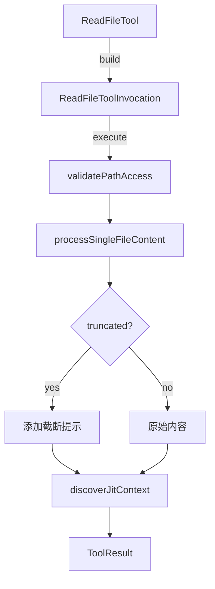

# read-file.ts

> 单文件读取工具，支持文本、图片、音频、PDF 文件的内容读取和行范围指定。

## 概述
`ReadFileTool` 实现了 `read_file` 工具，用于读取工作区内单个文件的内容。支持指定起始行和结束行进行精准读取，自动处理文本截断提示，并支持 JIT 上下文发现（自动附加子目录中的上下文信息）。包含路径验证、gitignore/geminiignore 过滤和遥测日志记录。

## 架构图

## 主要导出

### 接口
- `ReadFileToolParams` - 参数：`file_path` (必选), `start_line` / `end_line` (可选, 1-based)

### 类
- `ReadFileTool extends BaseDeclarativeTool` - 文件读取工具，Kind 为 Read，支持 FileDiscoveryService 过滤

## 核心逻辑
1. 路径解析为绝对路径后验证是否在工作区内
2. 调用 `processSingleFileContent` 处理多种文件类型
3. 截断时在内容前添加提示信息，指导 LLM 使用 start_line/end_line 继续读取
4. 记录文件操作遥测（行数、MIME 类型、编程语言）

## 内部依赖
- `./tools.ts`, `./tool-error.ts`, `./tool-names.ts`
- `./definitions/coreTools.ts`, `./definitions/resolver.ts`
- `./jit-context.ts` - JIT 上下文发现
- `../utils/fileUtils.ts` - 文件处理工具
- `../services/fileDiscoveryService.ts` - 文件过滤
- `../policy/utils.ts` - 策略参数模式
- `../telemetry/` - 遥测日志

## 外部依赖
- `node:path`
- `@google/genai` - `PartUnion`
