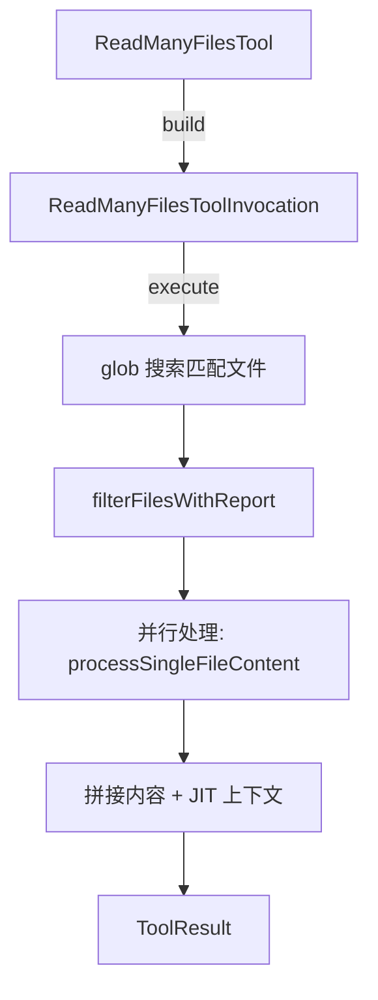

# read-many-files.ts

> 批量文件读取工具，通过 glob 模式匹配并拼接多个文件的内容。

## 概述
`ReadManyFilesTool` 实现了 `read_many_files` 工具，通过 glob 模式匹配多个文件并将其内容拼接返回。支持包含/排除模式、默认排除规则、gitignore/geminiignore 过滤。对于图片/音频/PDF 等非文本文件，仅在明确请求时处理。每个文件内容以 `--- {filePath} ---` 分隔符分隔，并在末尾添加 `--- End of content ---`。

## 架构图

## 主要导出

### 接口
- `ReadManyFilesParams` - 参数：`include` (必选 glob 数组), `exclude`, `recursive`, `useDefaultExcludes`, `file_filtering_options`

### 类
- `ReadManyFilesTool extends BaseDeclarativeTool` - 批量读取工具，Kind 为 Read

## 核心逻辑
1. 遍历所有工作区目录，对每个 include 模式执行 glob 匹配
2. 合并默认排除和用户指定排除模式
3. 使用 `Promise.allSettled` 并行处理所有文件
4. 非文本文件（图片/PDF/音频）仅在模式显式包含其扩展名或文件名时处理
5. 记录跳过文件的原因（安全检查、ignore 文件、非明确请求的资源文件等）

## 内部依赖
- `./tools.ts`, `./tool-error.ts`, `./tool-names.ts`
- `./definitions/coreTools.ts`, `./definitions/resolver.ts`
- `./jit-context.ts` - JIT 上下文
- `../utils/fileUtils.ts` - 文件处理
- `../telemetry/` - 遥测

## 外部依赖
- `glob` - 文件模式匹配
- `node:fs/promises`, `node:path`
- `@google/genai` - `PartListUnion`
