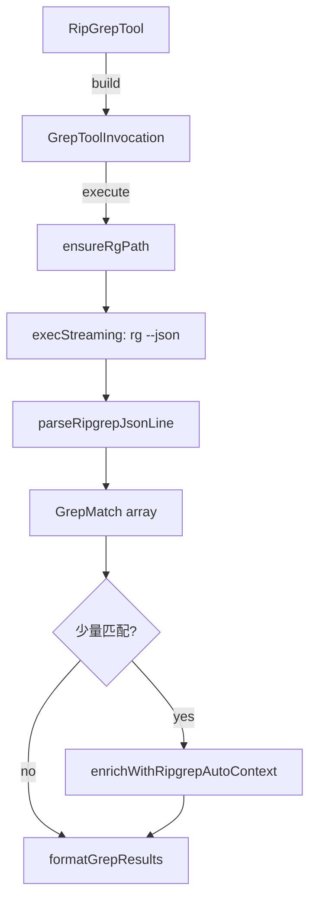

# ripGrep.ts

> 基于 ripgrep 的高性能文本搜索工具，支持正则表达式、上下文行、文件过滤等高级功能。

## 概述
`RipGrepTool` 实现了 `grep_search` 工具，封装了 ripgrep (`rg`) 二进制文件进行高性能文本搜索。支持正则表达式和字面量搜索、大小写控制、上下文行显示、文件模式过滤、自动上下文丰富（少量匹配时自动增加上下文行数），以及搜索超时保护。ripgrep 二进制由 `@joshua.litt/get-ripgrep` 按需下载到全局 bin 目录。

## 架构图

## 主要导出

### 函数
- `canUseRipgrep()`: 检查 rg 是否可用
- `ensureRgPath()`: 确保 rg 已下载并返回路径

### 接口
- `RipGrepToolParams` - 参数：`pattern`(必选), `dir_path`, `include_pattern`, `exclude_pattern`, `names_only`, `case_sensitive`, `fixed_strings`, `context/after/before`, `no_ignore`, `max_matches_per_file`, `total_max_matches`

### 类
- `RipGrepTool extends BaseDeclarativeTool` - grep 搜索工具，Kind 为 Search

## 核心逻辑
1. **自动上下文丰富**：匹配数 1-3 个时，自动以更大的上下文行数重新搜索（1 个匹配给 50 行，2-3 个给 15 行）
2. **流式解析**：使用 `execStreaming` 流式读取 rg 的 JSON 输出，达到 maxMatches 时立即停止
3. **超时保护**：默认 30 秒搜索超时
4. **文件过滤**：搜索结果经 `FileDiscoveryService` 二次过滤，尊重 gitignore/geminiignore
5. **ripgrep 获取**：使用单例 Promise 防止并发下载

## 内部依赖
- `./tools.ts`, `./tool-error.ts`, `./tool-names.ts`
- `./definitions/coreTools.ts`, `./definitions/resolver.ts`
- `./grep-utils.ts` - 搜索结果格式化
- `./constants.ts` - 默认匹配数和超时时间
- `../services/fileDiscoveryService.ts` - 文件过滤
- `../config/storage.ts` - 全局 bin 目录
- `../utils/shell-utils.ts` - `execStreaming`

## 外部依赖
- `@joshua.litt/get-ripgrep` - ripgrep 下载
- `node:fs`, `node:fs/promises`, `node:path`
