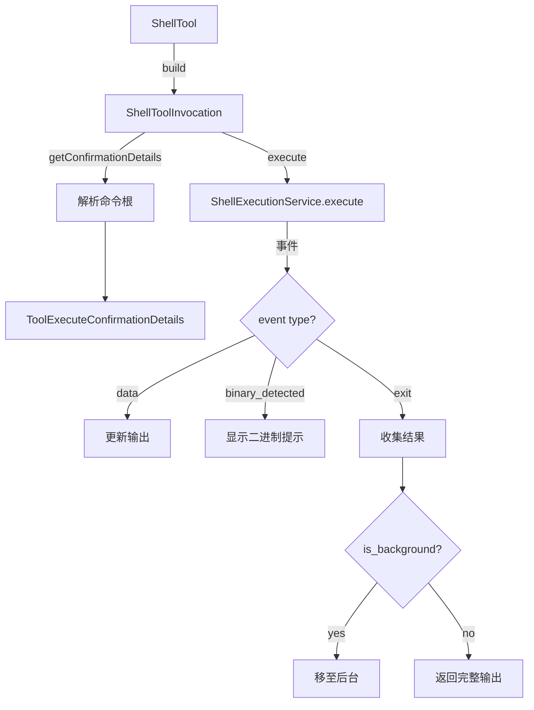

# shell.ts

> Shell 命令执行工具，支持前台/后台执行、实时输出流、超时控制和二进制流检测。

## 概述
`ShellTool` 实现了 `run_shell_command` 工具，在 bash（或 Windows 上的 PowerShell）中执行用户指定的 shell 命令。支持实时输出流更新、后台执行模式、不活动超时自动取消、二进制输出检测、进程组管理（通过 pgrep 捕获子进程 PID），以及可选的输出摘要功能。命令执行前需要策略引擎确认。

## 架构图

## 主要导出

### 常量
- `OUTPUT_UPDATE_INTERVAL_MS = 1000` - 输出更新间隔

### 接口
- `ShellToolParams` - 参数：`command`(必选), `description`, `dir_path`, `is_background`

### 类
- `ShellTool extends BaseDeclarativeTool` - Shell 执行工具，Kind 为 Execute
- `ShellToolInvocation extends BaseToolInvocation` - 单次命令执行器

## 核心逻辑
1. **命令包装**：非 Windows 时用 `{ command; }; pgrep -g 0 >tempfile; exit $__code;` 包装以捕获后台 PID
2. **不活动超时**：任何输出事件重置超时计时器，超时后自动 abort
3. **后台执行**：`is_background=true` 时延迟 200ms 后调用 `ShellExecutionService.background(pid)`
4. **策略更新**：确认时提取命令根（如 `git`, `npm`）用于策略更新

## 内部依赖
- `./tools.ts`, `./tool-error.ts`, `./tool-names.ts`
- `./definitions/coreTools.ts`, `./definitions/resolver.ts`
- `../services/shellExecutionService.ts` - Shell 执行服务
- `../utils/shell-utils.ts` - 命令解析工具
- `../utils/summarizer.ts` - 输出摘要
- `../config/agent-loop-context.ts` - Agent 循环上下文

## 外部依赖
- `node:fs/promises`, `node:path`, `node:os`, `node:crypto`
