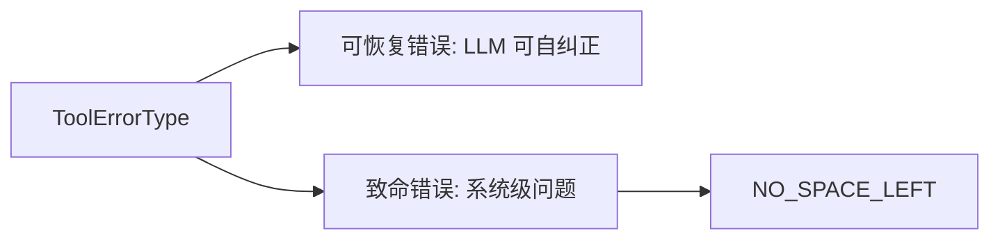

# tool-error.ts

> 工具错误类型的统一枚举定义和致命错误判断函数。

## 概述
定义了工具系统中所有可能的错误类型枚举 `ToolErrorType`，分为通用错误、文件系统错误、编辑错误、搜索错误、MCP 错误、Shell 错误、Web 错误、Hook 错误等类别。同时提供 `isFatalToolError` 函数判断错误是否为致命错误（当前仅 `NO_SPACE_LEFT`），致命错误会导致 CLI 退出而非让 LLM 重试。

## 架构图

## 主要导出

### `enum ToolErrorType`
约 30+ 种错误类型，涵盖：通用（`INVALID_TOOL_PARAMS`, `UNKNOWN`）、文件（`FILE_NOT_FOUND`, `PERMISSION_DENIED`, `NO_SPACE_LEFT`）、编辑（`EDIT_NO_OCCURRENCE_FOUND`）、MCP（`MCP_TOOL_ERROR`）、Web（`WEB_FETCH_FALLBACK_FAILED`）等。

### `isFatalToolError(errorType?: string): boolean`
判断错误类型是否致命，当前仅 `NO_SPACE_LEFT` 为致命错误。

## 核心逻辑
错误分为两类：可恢复（LLM 可以通过修正参数、尝试其他文件/方法自行恢复）和致命（系统状态异常，继续执行无意义）。

## 内部依赖
无

## 外部依赖
无
