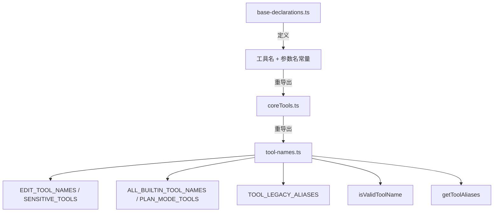

# tool-names.ts

> 工具名称常量、参数名常量、遗留别名映射、敏感工具集合和工具名称验证的统一注册表。

## 概述
本文件是所有工具名称和参数名称常量的转发中心，从 `definitions/coreTools.ts` 导入并重新导出。同时定义了工具编辑集合（`EDIT_TOOL_NAMES`）、敏感工具集合（`SENSITIVE_TOOLS`）、计划模式工具列表、遗留别名映射（`TOOL_LEGACY_ALIASES`）、所有内建工具名称数组（`ALL_BUILTIN_TOOL_NAMES`），以及完整的工具名称验证函数 `isValidToolName`（支持内建、MCP、discovered、通配符等命名格式）。

## 架构图

## 主要导出

### 常量集合
- `EDIT_TOOL_NAMES`: `Set<replace, write_file>`
- `SENSITIVE_TOOLS`: 可访问文件/网络的敏感工具集
- `ALL_BUILTIN_TOOL_NAMES`: 所有内建工具名数组 (~25 个)
- `PLAN_MODE_TOOLS`: 计划模式可用的只读工具
- `TOOL_LEGACY_ALIASES`: 旧名映射（如 `search_file_content -> grep_search`）
- `DISCOVERED_TOOL_PREFIX = 'discovered_tool_'`

### 函数
- `getToolAliases(name)`: 获取工具的所有别名（含遗留名和当前名）
- `isValidToolName(name, options?)`: 验证工具名是否合法（支持内建、MCP FQN、discovered、通配符）

## 核心逻辑
`isValidToolName` 执行多层验证：内建工具 -> 遗留别名 -> discovered 前缀 -> 全局通配符 -> MCP 全限定名（含 server/tool 组件 slug 验证）

## 内部依赖
- `./definitions/coreTools.ts` - 名称常量来源
- `./mcp-tool.ts` - `isMcpToolName`, `parseMcpToolName`, `MCP_TOOL_PREFIX`

## 外部依赖
无
