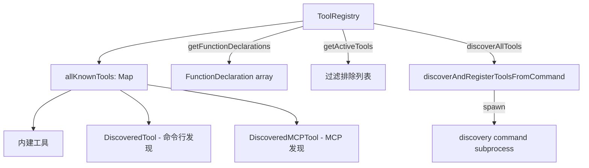

# tool-registry.ts

> 工具注册表：管理所有内建工具、MCP 工具和动态发现工具的注册、查询和 schema 输出。

## 概述
`ToolRegistry` 是工具系统的中央注册表，负责维护所有已知工具（内建 + MCP + 命令行发现）的集合。提供工具注册/注销、按服务器过滤、排除列表处理、FunctionDeclaration 输出（含 Plan Mode 特殊处理）、遗留别名解析，以及通过命令行 discovery 命令动态发现工具的功能。内部维护 `allKnownTools` Map，通过 `getActiveTools` 过滤被排除的工具。

## 架构图

## 主要导出

### 类
- `ToolRegistry` - 工具注册表
  - `registerTool(tool)` / `unregisterTool(name)`: 注册/注销工具
  - `sortTools()`: 排序（内建 -> Discovered -> MCP by server）
  - `removeMcpToolsByServer(serverName)`: 移除指定服务器的 MCP 工具
  - `discoverAllTools()`: 通过命令行发现工具
  - `getFunctionDeclarations(modelId?)`: 获取所有活跃工具的 schema（Plan Mode 下自动修改 write_file/replace 的描述）
  - `getFunctionDeclarationsFiltered(toolNames, modelId?)`: 按名称过滤获取 schema
  - `getAllToolNames()` / `getAllTools()` / `getToolsByServer(serverName)`: 查询工具
  - `getTool(name)`: 按名称查找（含遗留别名解析）

- `DiscoveredTool extends BaseDeclarativeTool` - 通过命令行发现的外部工具，执行时 spawn 子进程

## 核心逻辑
1. **排除列表处理**：`getExcludeTools` 返回的排除集合会通过 `expandExcludeToolsWithAliases` 展开遗留别名
2. **命令行工具发现**：执行 `toolDiscoveryCommand`，解析 JSON 输出为 FunctionDeclaration，注册为 `DiscoveredTool`
3. **Plan Mode 处理**：Plan Mode 下 write_file 和 replace 的 description 被修改，限制仅能编辑计划目录中的文件
4. **工具元数据构建**：为策略引擎提供含 `_serverName` 的工具注解

## 内部依赖
- `./tools.ts` - 工具基类和接口
- `./mcp-tool.ts` - `DiscoveredMCPTool`
- `./tool-names.ts` - 名称常量和别名
- `./tool-error.ts` - 错误类型
- `../config/config.ts` - 配置
- `../policy/types.ts` - `ApprovalMode`

## 外部依赖
- `@google/genai` - `FunctionDeclaration`
- `node:child_process` - `spawn`
- `node:string_decoder` - `StringDecoder`
- `shell-quote` - 命令解析
