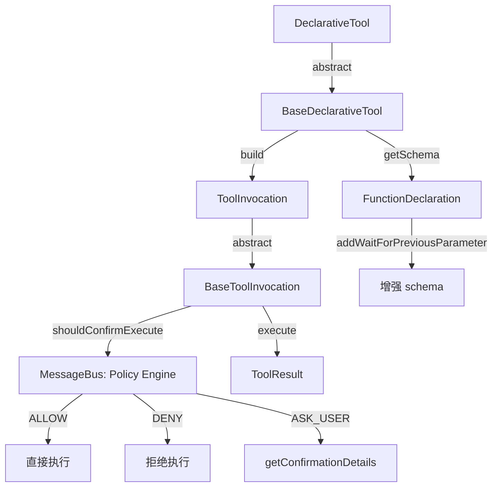

# tools.ts

> 工具系统的核心抽象层：定义工具调用、构建、验证、确认和执行的全部接口与基类（约 970 行）。

## 概述
本文件是整个工具系统的类型基础和行为基础，定义了声明式工具体系的核心接口和抽象类。包括：`ToolInvocation`（单次调用执行器接口）、`DeclarativeTool` / `BaseDeclarativeTool`（工具定义抽象类，含参数验证和 schema 管理）、`BaseToolInvocation`（调用执行器基类，含策略引擎交互和确认流程）、`ToolResult`（工具执行结果）、各类确认详情（edit/exec/mcp/info/ask_user/exit_plan_mode），以及工具分类枚举 `Kind`。

## 架构图

## 主要导出

### 核心接口
- `ToolInvocation<TParams, TResult>` - 已验证的工具调用执行器
- `ToolBuilder<TParams, TResult>` - 工具构建器（验证+创建调用）
- `ToolResult` - 执行结果：`llmContent` + `returnDisplay` + 可选 `error` / `data` / `tailToolCallRequest`
- `PolicyUpdateOptions` - 策略更新选项
- `BackgroundExecutionData` - 后台执行元数据

### 抽象类
- `DeclarativeTool<TParams, TResult>` - 声明式工具基类，提供 `getSchema`（自动添加 `wait_for_previous` 参数）、`build`、`buildAndExecute`、`validateBuildAndExecute`
- `BaseDeclarativeTool<TParams, TResult>` - 增强基类，`build` 中自动执行 JSON schema 验证 + `validateToolParamValues`
- `BaseToolInvocation<TParams, TResult>` - 调用基类，`shouldConfirmExecute` 通过 MessageBus 与策略引擎交互

### 确认详情类型（联合类型 `ToolCallConfirmationDetails`）
- `ToolEditConfirmationDetails` - 文件编辑确认
- `ToolExecuteConfirmationDetails` - Shell 命令确认
- `ToolMcpConfirmationDetails` - MCP 工具确认
- `ToolInfoConfirmationDetails` - 通用信息确认
- `ToolAskUserConfirmationDetails` - 用户问答确认
- `ToolExitPlanModeConfirmationDetails` - 退出计划模式确认

### 枚举
- `Kind` - 工具分类：Read / Edit / Delete / Move / Search / Execute / Think / Agent / Fetch / Communicate / Plan / SwitchMode / Other
- `ToolConfirmationOutcome` - 确认结果：ProceedOnce / ProceedAlways / ProceedAlwaysAndSave / ProceedAlwaysServer / ProceedAlwaysTool / ModifyWithEditor / Cancel

### 工具函数
- `isTool(obj)`: 工具类型守卫
- `isBackgroundExecutionData(data)`: 后台执行数据类型守卫
- `hasCycleInSchema(schema)`: 检测 JSON schema 中的 `$ref` 循环引用

### 常量
- `MUTATOR_KINDS` - 有副作用的 Kind 列表
- `READ_ONLY_KINDS` - 只读的 Kind 列表

### 其他类型
- `ToolLiveOutput` / `ToolResultDisplay` / `TodoList` / `Todo` / `FileDiff` / `DiffStat` / `ToolLocation`

## 核心逻辑
1. **策略引擎交互**：`BaseToolInvocation.shouldConfirmExecute` 通过 MessageBus 发布确认请求，等待响应（30秒超时默认 ASK_USER）
2. **wait_for_previous 参数**：所有工具 schema 自动注入此布尔参数，允许模型控制并行/串行执行
3. **Schema 循环检测**：`hasCycleInSchema` 通过 DFS 遍历 `$ref` 引用，检测并标记循环引用

## 内部依赖
- `./tool-error.ts` - `ToolErrorType`
- `../utils/schemaValidator.ts` - `SchemaValidator`
- `../utils/markdownUtils.ts` - `isRecord`
- `../confirmation-bus/types.ts` - 消息类型
- `../confirmation-bus/message-bus.ts` - `MessageBus`
- `../policy/types.ts` - `ApprovalMode`

## 外部依赖
- `@google/genai` - `FunctionDeclaration`, `PartListUnion`
- `node:crypto` - `randomUUID`
