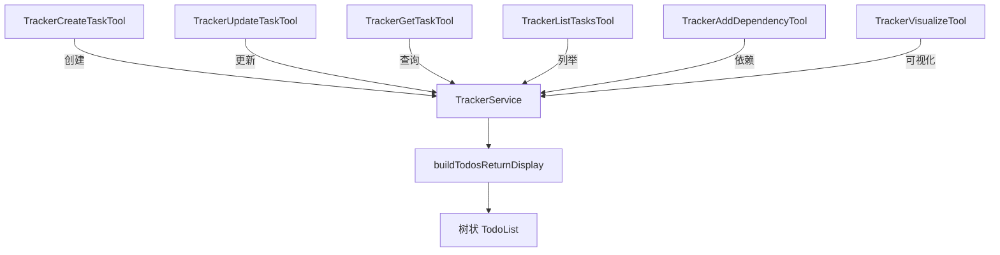

# trackerTools.ts

> 任务追踪器工具集：创建、更新、查询、列举、添加依赖和可视化任务。

## 概述
本文件实现了六个任务追踪相关的工具，对接 `TrackerService` 服务。任务支持层级关系（parentId）和依赖关系（dependencies），支持 epic/task/bug 三种类型和 open/in_progress/blocked/closed 四种状态。所有工具的 `returnDisplay` 统一使用 `buildTodosReturnDisplay` 生成树状 TodoList 视图。

## 架构图

## 主要导出

### 函数
- `buildTodosReturnDisplay(service)`: 从 TrackerService 构建树状 TodoList 显示，含循环检测

### 类（每个含对应 Invocation 内部类）
- `TrackerCreateTaskTool` - 创建任务（Kind.Edit）
- `TrackerUpdateTaskTool` - 更新任务（Kind.Edit）
- `TrackerGetTaskTool` - 查询任务详情（Kind.Read）
- `TrackerListTasksTool` - 列举任务，支持按 status/type/parentId 过滤（Kind.Search）
- `TrackerAddDependencyTool` - 添加任务依赖（Kind.Edit），含自引用检测
- `TrackerVisualizeTool` - ASCII 树状可视化（Kind.Read），含状态 emoji 和依赖展示

## 核心逻辑
1. 所有任务工具共享 `buildTodosReturnDisplay` 以一致的树状格式展示任务状态
2. 循环检测：树遍历时使用 `visited` Set，遇到循环时输出 `[CYCLE DETECTED]`
3. AddDependency 工具预先验证：拒绝自引用，检查两个任务是否存在

## 内部依赖
- `./tools.ts`, `./tool-error.ts`, `./tool-names.ts`
- `./definitions/trackerTools.ts`, `./definitions/resolver.ts`
- `../config/config.ts` - Config
- `../services/trackerTypes.ts` - `TrackerTask`, `TaskStatus`, `TaskType`
- `../services/trackerService.ts` - `TrackerService`

## 外部依赖
无
