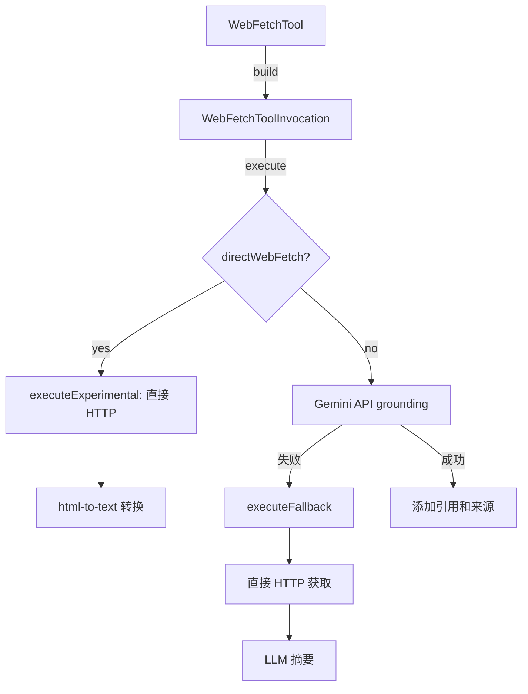

# web-fetch.ts

> Web 内容获取工具：从 URL 抓取内容，支持 Gemini API 主路径和直接 HTTP 回退路径。

## 概述
`WebFetchTool` 实现了 `web_fetch` 工具，支持两种模式：标准模式（通过 Gemini API 的 grounding 能力处理 URL）和直接获取模式（`directWebFetch` 配置项）。标准模式失败时自动回退到直接 HTTP 获取 + LLM 摘要。内置速率限制（每主机每分钟 10 次）、私有 IP 阻止、GitHub URL 自动转换为 raw 格式、内容大小限制和重试机制。

## 架构图

## 主要导出

### 函数
- `normalizeUrl(urlStr)`: URL 标准化（小写主机、去尾斜杠、去默认端口）
- `parsePrompt(text)`: 从提示文本中提取有效 URL
- `convertGithubUrlToRaw(urlStr)`: GitHub blob URL 转 raw URL

### 接口
- `WebFetchToolParams` - 参数：`prompt`（标准模式）或 `url`（直接模式）

### 类
- `WebFetchTool extends BaseDeclarativeTool` - Web 获取工具，Kind 为 Fetch

## 核心逻辑
1. **速率限制**：LRU Cache 存储每主机的请求时间戳，每分钟最多 10 次
2. **私有 IP 阻止**：阻止 localhost、127.0.0.1 和所有私有 IP 地址
3. **Grounding 引用注入**：在响应文本中插入引用标记 `[1]` `[2]`，末尾附加来源列表
4. **直接模式内容处理**：根据 Content-Type 分别处理 markdown/json/html/image/video/pdf

## 内部依赖
- `./tools.ts`, `./tool-error.ts`, `./tool-names.ts`
- `./definitions/coreTools.ts`, `./definitions/resolver.ts`
- `../utils/fetch.ts`, `../utils/textUtils.ts`, `../utils/partUtils.ts`
- `../utils/retry.ts` - 重试逻辑
- `../telemetry/` - 遥测
- `../config/agent-loop-context.ts` - Agent 上下文

## 外部依赖
- `html-to-text` - HTML 转纯文本
- `mnemonist` - LRU Cache
