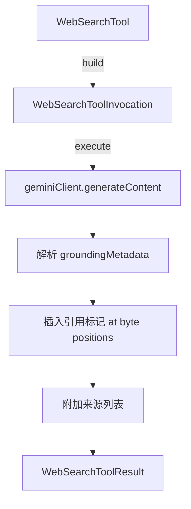

# web-search.ts

> Google 搜索工具：通过 Gemini API 的 grounding 能力执行 Web 搜索并返回带引用的结果。

## 概述
`WebSearchTool` 实现了 `google_web_search` 工具，通过 Gemini API 执行带 grounding 的搜索查询，返回综合答案并附带内联引用标记和来源列表。引用标记基于 UTF-8 字节位置精确插入到响应文本中。

## 架构图

## 主要导出

### 接口
- `WebSearchToolParams` - 参数：`query`(必选)
- `WebSearchToolResult extends ToolResult` - 结果含可选 `sources`

### 类
- `WebSearchTool extends BaseDeclarativeTool` - 搜索工具，Kind 为 Search

## 核心逻辑
1. 调用 Gemini API 的 `web-search` 模型角色进行搜索
2. 从 `groundingMetadata.groundingSupports` 提取引用段落位置和对应的 chunk 索引
3. 使用 `TextEncoder/TextDecoder` 精确按 UTF-8 字节位置插入引用标记（如 `[1][2]`）
4. 在文本末尾附加格式化的来源列表

## 内部依赖
- `./tools.ts`, `./tool-error.ts`, `./tool-names.ts`
- `./definitions/coreTools.ts`, `./definitions/resolver.ts`
- `../utils/partUtils.ts` - `getResponseText`
- `../utils/errors.ts` - `isAbortError`
- `../telemetry/llmRole.ts` - `LlmRole`
- `../config/agent-loop-context.ts` - Agent 上下文

## 外部依赖
- `@google/genai` - `GroundingMetadata`
