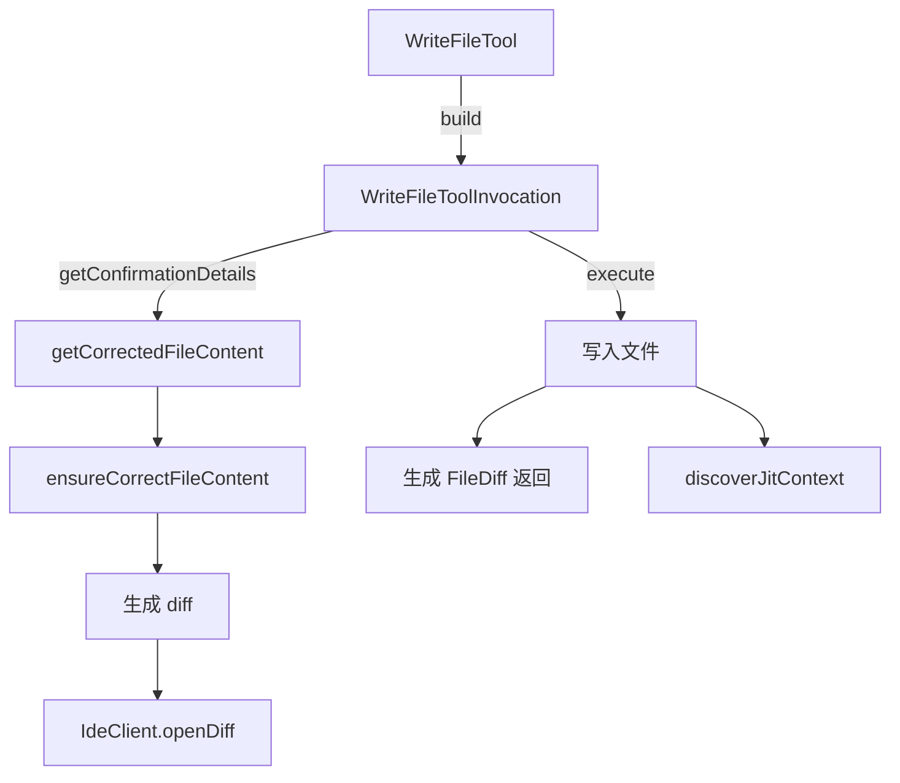

# write-file.ts

> 文件写入工具：创建或覆盖文件，支持内容纠正、diff 预览、IDE 集成和用户编辑。

## 概述
`WriteFileTool` 实现了 `write_file` 工具，将内容写入指定文件。写入前通过 `ensureCorrectFileContent` 进行 LLM 辅助的内容纠正（如修复转义问题），生成 diff 供用户确认，支持 IDE diff 编辑器集成和用户修改后的内容覆盖。实现了 `ModifiableDeclarativeTool` 接口，支持外部编辑器修改。还包含省略占位符检测，拒绝不完整的内容。

## 架构图

## 主要导出

### 接口
- `WriteFileToolParams` - 参数：`file_path`, `content`(必选), `modified_by_user?`, `ai_proposed_content?`

### 函数
- `isWriteFileToolParams(args)`: 类型守卫
- `getCorrectedFileContent(config, filePath, proposedContent, abortSignal)`: 获取纠正后的文件内容

### 类
- `WriteFileTool extends BaseDeclarativeTool implements ModifiableDeclarativeTool` - 文件写入工具，Kind 为 Edit

## 核心逻辑
1. **内容纠正**：通过 LLM 纠正潜在的转义问题（Gemini 3 模型跳过激进反转义）
2. **行尾处理**：已有文件使用其原有行尾风格（CRLF/LF），新文件使用 OS 默认
3. **省略占位符检测**：调用 `detectOmissionPlaceholders` 拒绝含 `rest of methods ...` 等占位符的内容
4. **DiffStat 计算**：区分模型修改和用户修改的统计

## 内部依赖
- `./tools.ts`, `./tool-error.ts`, `./tool-names.ts`, `./modifiable-tool.ts`
- `./omissionPlaceholderDetector.ts` - 省略检测
- `./definitions/coreTools.ts`, `./definitions/resolver.ts`
- `./diff-utils.ts`, `./diffOptions.ts` - diff 相关
- `./jit-context.ts` - JIT 上下文
- `../ide/ide-client.ts` - IDE 集成
- `../utils/editCorrector.ts` - 内容纠正

## 外部依赖
- `node:fs`, `node:fs/promises`, `node:path`, `node:os`
- `diff` - 文本差异生成
