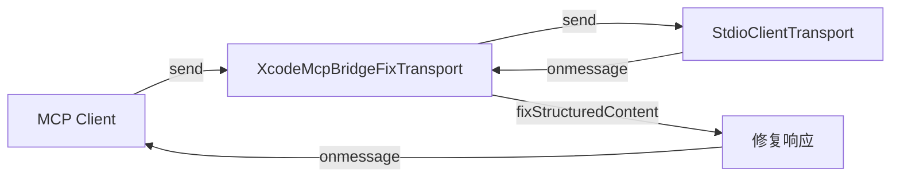

# xcode-mcp-fix-transport.ts

> Xcode mcpbridge 非标准响应修复传输层包装器。

## 概述
`XcodeMcpBridgeFixTransport` 是 MCP Transport 的包装器（装饰器模式），用于修复 Xcode 26.3 的 `mcpbridge` 工具返回非标准 MCP 响应的问题。具体问题是：当工具有 output schema 时，mcpbridge 将结果放在 `content` 字段（纯文本 JSON）而非 `structuredContent` 字段。此包装器拦截响应消息，尝试将 text content 解析为 JSON 并填充到 `structuredContent`。

## 架构图

## 主要导出

### `class XcodeMcpBridgeFixTransport extends EventEmitter implements Transport`
- 代理所有 Transport 方法（`start`, `close`, `send`）
- 拦截 `onmessage`，对 JSON-RPC response 执行 `fixStructuredContent`

## 核心逻辑
1. 仅处理包含 `result` 的 JSON-RPC 响应
2. 检查 `result.content` 存在且 `result.structuredContent` 不存在
3. 尝试将第一个 text 类型内容块的文本解析为 JSON
4. 成功则填充 `structuredContent`，失败则静默跳过

## 内部依赖
无

## 外部依赖
- `@modelcontextprotocol/sdk/shared/transport.js` - `Transport`
- `@modelcontextprotocol/sdk/types.js` - `JSONRPCMessage`, `JSONRPCResponse`
- `node:events` - `EventEmitter`
