# utils 架构

> 通用工具函数集合，提供文件操作、路径处理、错误处理、网络、安全等基础设施

## 概述

`utils` 模块是 Gemini CLI 最大的辅助模块，包含 70+ 个工具文件，提供跨系统使用的基础功能。涵盖领域包括：API 转换、审批模式工具、身份认证、缓存、通道通信、检查点管理、调试日志、延迟/重试、编辑修正、环境变量、错误处理、事件总线、退出码、文件操作（读写/diff/搜索/忽略规则）、格式化、Git 操作、Google 错误处理、安全、会话管理、Shell 解析、Token 计算、版本管理、工作区上下文等。该模块是所有其他模块的基础依赖。

## 架构图

```mermaid
graph TD
    A[utils/] --> B[核心基础设施]
    A --> C[文件系统]
    A --> D[网络与安全]
    A --> E[LLM 相关]
    A --> F[Shell 与终端]
    A --> G[事件与日志]

    B --> B1[errors.ts / errorReporting.ts]
    B --> B2[cache.ts / delay.ts / retry.ts]
    B --> B3[paths.ts / constants.ts]
    B --> B4[version.ts / package.ts]

    C --> C1[fileUtils.ts / fileDiffUtils.ts]
    C --> C2[gitIgnoreParser.ts / ignorePatterns.ts]
    C --> C3[getFolderStructure.ts]
    C --> C4[filesearch/ 子目录]

    D --> D1[fetch.ts / httpErrors.ts]
    D --> D2[oauth-flow.ts / authConsent.ts]
    D --> D3[security.ts / secure-browser-launcher.ts]

    E --> E1[tokenCalculation.ts]
    E --> E2[generateContentResponseUtilities.ts]
    E --> E3[partUtils.ts / thoughtUtils.ts]
    E --> E4[editCorrector.ts / llm-edit-fixer.ts]

    F --> F1[shell-utils.ts / getPty.ts]
    F --> F2[terminal.ts / terminalSerializer.ts]

    G --> G1[events.ts / debugLogger.ts]
    G --> G2[channel.ts / stdio.ts]
```



## 目录结构

```
utils/
├── errors.ts                   # 错误类型判断工具
├── errorParsing.ts             # 错误解析
├── errorReporting.ts           # 错误上报
├── events.ts                   # CoreEvents 事件总线
├── debugLogger.ts              # 调试日志（DEBUG=true 启用）
├── paths.ts                    # 路径常量（homedir, GEMINI_DIR）
├── constants.ts                # 通用常量
├── cache.ts                    # LRU 缓存
├── delay.ts                    # 延迟函数
├── retry.ts                    # 重试逻辑
├── version.ts                  # 版本信息
├── package.ts                  # 包信息
├── fileUtils.ts                # 文件操作工具
├── fileDiffUtils.ts            # 文件 Diff 工具
├── gitIgnoreParser.ts          # .gitignore 解析
├── ignorePatterns.ts           # 忽略模式
├── ignoreFileParser.ts         # 忽略文件解析
├── getFolderStructure.ts       # 目录结构获取
├── fetch.ts                    # HTTP 请求封装
├── httpErrors.ts               # HTTP 错误处理
├── oauth-flow.ts               # OAuth 认证流程
├── authConsent.ts              # 认证同意
├── security.ts                 # 安全工具（目录安全检查）
├── secure-browser-launcher.ts  # 安全浏览器启动
├── tokenCalculation.ts         # Token 计算
├── generateContentResponseUtilities.ts # LLM 响应处理
├── partUtils.ts                # Part 工具（提取文本/函数调用）
├── thoughtUtils.ts             # 思考内容处理
├── editCorrector.ts            # 编辑修正器
├── llm-edit-fixer.ts           # LLM 编辑修复
├── shell-utils.ts              # Shell 命令解析（tree-sitter）
├── getPty.ts                   # PTY 获取
├── terminal.ts                 # 终端工具
├── terminalSerializer.ts       # 终端输出序列化
├── events.ts                   # 事件总线（CoreEvents）
├── channel.ts                  # 异步通道
├── stdio.ts                    # 标准 IO 工具
├── session.ts                  # 会话管理
├── sessionUtils.ts             # 会话工具
├── surface.ts                  # UI 表面信息
├── headless.ts                 # 无头模式
├── memoryDiscovery.ts          # GEMINI.md 文件发现
├── memoryImportProcessor.ts    # 记忆导入处理
├── tool-utils.ts               # 工具名称建议
├── toolCallContext.ts           # 工具调用上下文
├── approvalModeUtils.ts        # 审批模式工具
├── apiConversionUtils.ts       # API 转换工具
├── checkpointUtils.ts          # 检查点管理
├── compatibility.ts            # 兼容性检查
├── customHeaderUtils.ts        # 自定义 HTTP 头
├── deadlineTimer.ts            # 截止时间计时器
├── editor.ts                   # 编辑器类型
├── envExpansion.ts              # 环境变量展开
├── environmentContext.ts        # 环境上下文
├── exitCodes.ts                 # 退出码定义
├── extensionLoader.ts           # 扩展加载器
├── fastAckHelper.ts             # 快速确认辅助
├── formatters.ts                # 格式化工具
├── fsErrorMessages.ts           # 文件系统错误消息
├── gitUtils.ts                  # Git 工具函数
├── googleErrors.ts              # Google API 错误处理
├── googleQuotaErrors.ts         # Google 配额错误
├── installationManager.ts       # 安装管理器
├── language-detection.ts        # 语言检测
├── markdownUtils.ts             # Markdown 工具
├── messageInspectors.ts         # 消息检查器
├── nextSpeakerChecker.ts        # 下一发言者检查
├── pathCorrector.ts             # 路径修正器
├── pathReader.ts                # 路径读取器
├── planUtils.ts                 # 计划模式工具
├── process-utils.ts             # 进程工具
├── promptIdContext.ts           # Prompt ID 上下文
├── quotaErrorDetection.ts       # 配额错误检测
├── safeJsonStringify.ts         # 安全 JSON 序列化
├── schemaValidator.ts           # Schema 验证器
├── systemEncoding.ts            # 系统编码
├── textUtils.ts                 # 文本工具
├── workspaceContext.ts          # 工作区上下文
├── bfsFileSearch.ts             # 广度优先文件搜索
├── browser.ts                   # 浏览器工具
├── checks.ts                    # 检查工具
└── filesearch/                  # 文件搜索子系统
```

## 关键文件

| 文件 | 功能 |
|------|------|
| `events.ts` | `CoreEvents` 单例事件总线，提供 emitFeedback、emitToolCallUpdate 等事件发射方法，是模块间通信的核心 |
| `debugLogger.ts` | 调试日志工具，通过 DEBUG 环境变量控制，提供 debug/warn/error 方法 |
| `shell-utils.ts` | 使用 tree-sitter 解析 Shell 命令为 AST，支持命令拆分、管道识别、重定向检测 |
| `tokenCalculation.ts` | Token 计算工具，估算文本和工具调用的 token 消耗 |
| `errors.ts` | `isNodeError` 等错误类型判断工具函数 |
| `security.ts` | `isDirectorySecure` 检查目录的安全性（权限、所有权） |
| `editCorrector.ts` | 编辑修正器，修复 LLM 生成的不精确编辑操作 |
| `memoryDiscovery.ts` | GEMINI.md 文件的多层级发现（全局、扩展、项目） |

## 内部依赖

`utils` 作为基础模块，被几乎所有其他模块依赖。自身内部文件之间也存在广泛的相互引用。

## 外部依赖

| 包 | 用途 |
|------|------|
| `tree-sitter` / `tree-sitter-bash` | Shell 命令解析 |
| `picomatch` | Glob 模式匹配 |
| `diff` | 文本差异比较 |
| `fzf` | 模糊搜索 |
| `open` | 打开浏览器/编辑器 |
| `fast-levenshtein` | 编辑距离计算 |
