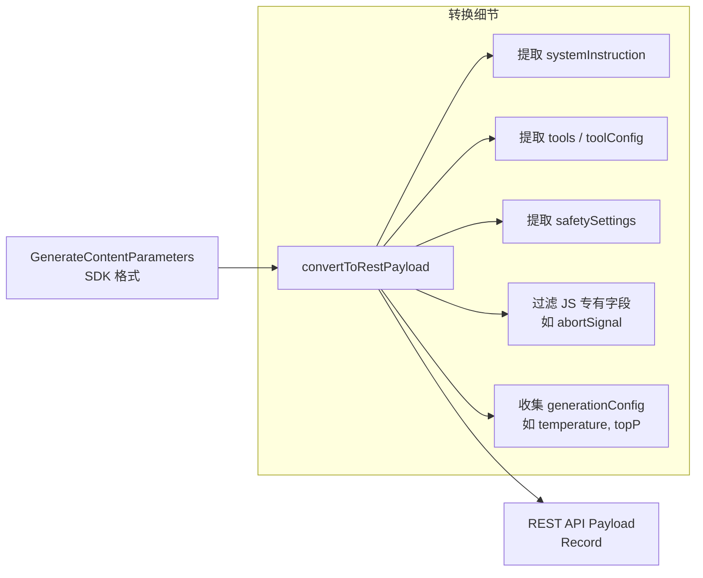

# apiConversionUtils.ts

> 将 SDK 的 GenerateContentParameters 对象转换为 REST API 有效载荷格式

## 概述
该文件提供了一个工具函数，用于将 Google GenAI SDK 的 `GenerateContentParameters` 对象转换为等效的 REST API 请求负载格式。主要用于调试和导出请求场景，使开发者能够以标准 REST 格式查看和分析 API 请求。该文件在模块中扮演 SDK 与 REST API 之间的桥梁角色。

## 架构图

## 主要导出

### `convertToRestPayload(req: GenerateContentParameters): Record<string, unknown>`
将 SDK 格式的 `GenerateContentParameters` 转换为 REST API 负载格式。

- **参数**: `req` - SDK 的 `GenerateContentParameters` 对象
- **返回值**: REST API 格式的负载对象
- **逻辑**:
  1. 从 `req.config` 中解构出顶层 REST 字段（systemInstruction、tools、toolConfig、safetySettings、cachedContent）
  2. 排除 JS 专有字段（如 `abortSignal`）
  3. 将剩余字段归入 `generationConfig`
  4. 标准化 `systemInstruction`（字符串转为 `{ parts: [{ text }] }` 格式）
  5. 仅在存在有效值时包含各字段

## 核心逻辑
- **字段分离**: 通过解构赋值将 SDK config 中的字段分为「REST 顶层字段」和「生成配置参数」两组
- **systemInstruction 标准化**: 若为字符串则包装为 Content 格式对象；若为对象则原样保留
- **条件性包含**: 仅在字段有实际值时才添加到输出负载中，避免产生空字段

## 内部依赖
无

## 外部依赖
| 依赖 | 说明 |
|------|------|
| `@google/genai` | 提供 `GenerateContentParameters` 类型定义 |
