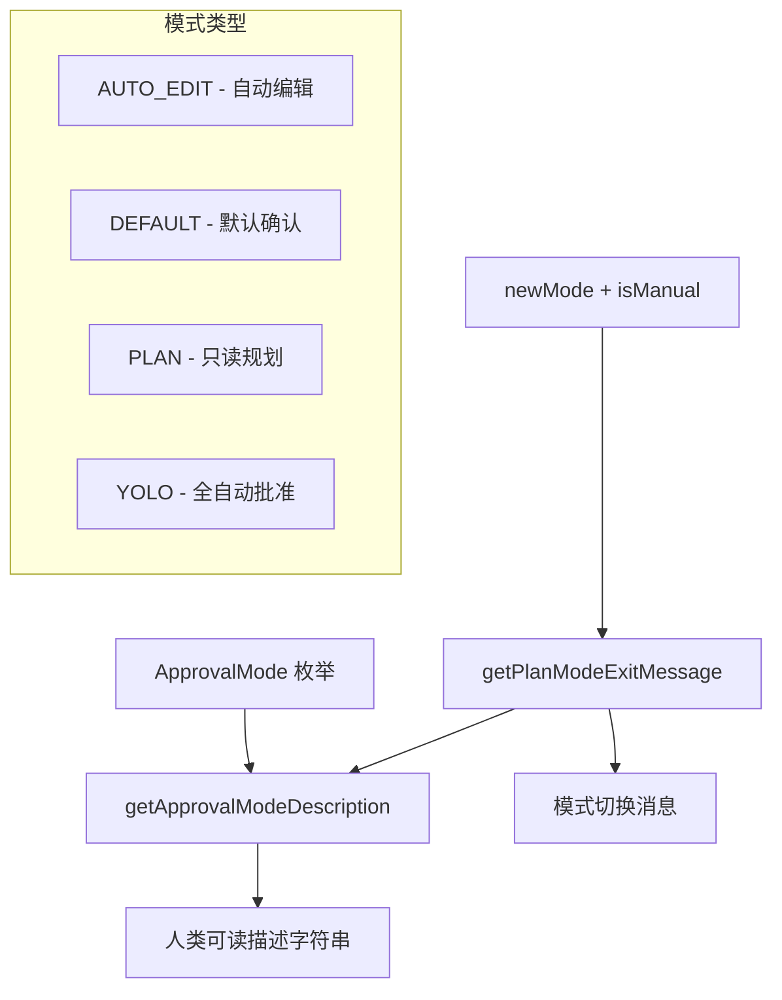

# approvalModeUtils.ts

> 提供审批模式的人类可读描述和模式切换消息生成

## 概述
该文件为不同的审批模式（ApprovalMode）提供了用户友好的文本描述，并生成计划模式退出时的过渡消息。在 CLI 的权限控制流程中，审批模式决定了工具调用是否需要用户确认，该文件负责将这些模式翻译为人类可读的文本。

## 架构图

## 主要导出

### `getApprovalModeDescription(mode: ApprovalMode): string`
返回指定审批模式的人类可读描述。

- **参数**: `mode` - ApprovalMode 枚举值
- **返回值**: 描述字符串，如 `"Auto-Edit mode (edits will be applied automatically)"`
- 使用 `checkExhaustive` 确保所有枚举值均被处理

### `getPlanModeExitMessage(newMode: ApprovalMode, isManual?: boolean): string`
生成从计划模式退出时的过渡消息。

- **参数**: `newMode` - 要切换到的新模式；`isManual` - 是否为手动退出（默认 false）
- **返回值**: 完整的模式切换消息

## 核心逻辑
- 使用 switch 语句将每个 ApprovalMode 枚举值映射到对应的描述文本
- 通过 `checkExhaustive` 在 default 分支中确保编译时穷尽检查
- 退出消息根据手动/自动方式添加不同前缀

## 内部依赖
| 模块 | 说明 |
|------|------|
| `../policy/types.js` | 提供 `ApprovalMode` 枚举 |
| `./checks.js` | 提供 `checkExhaustive` 穷尽检查函数 |

## 外部依赖
无
