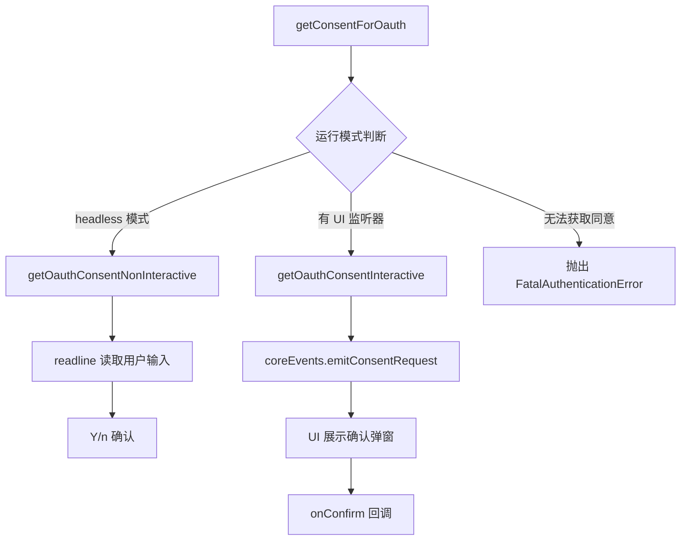

# authConsent.ts

> 处理 OAuth 登录的用户授权同意流程，支持交互式和非交互式（headless）模式

## 概述
该文件实现了 OAuth 认证过程中获取用户同意的逻辑。它根据运行环境自动选择合适的同意获取方式：在 headless 模式下通过标准输入/输出进行文字交互，在交互式模式下通过事件系统向 UI 发送同意请求。如果两种方式都不可用，则抛出致命认证错误。该文件是认证流程的关键入口。

## 架构图

## 主要导出

### `getConsentForOauth(prompt: string): Promise<boolean>`
请求用户授权 OAuth 登录。

- **参数**: `prompt` - 显示给用户的提示信息
- **返回值**: Promise<boolean>，用户是否同意
- **逻辑**:
  1. 拼接最终提示信息
  2. headless 模式 -> `getOauthConsentNonInteractive`
  3. 有 ConsentRequest 监听器 -> `getOauthConsentInteractive`
  4. 否则抛出 `FatalAuthenticationError`

## 核心逻辑
- **非交互式模式**: 使用 Node.js `readline` 创建接口，输出提示并等待用户输入 Y/n
- **交互式模式**: 通过 `coreEvents.emitConsentRequest` 发射事件，由 UI 层监听并展示确认界面
- **空输入/y 视为同意**: `['y', ''].includes(answer.trim().toLowerCase())`

## 内部依赖
| 模块 | 说明 |
|------|------|
| `./events.js` | 核心事件系统（CoreEvent、coreEvents） |
| `./errors.js` | FatalAuthenticationError 错误类 |
| `./stdio.js` | createWorkingStdio、writeToStdout |
| `./headless.js` | isHeadlessMode 判断 |

## 外部依赖
| 依赖 | 说明 |
|------|------|
| `node:readline` | Node.js 原生 readline 模块 |
