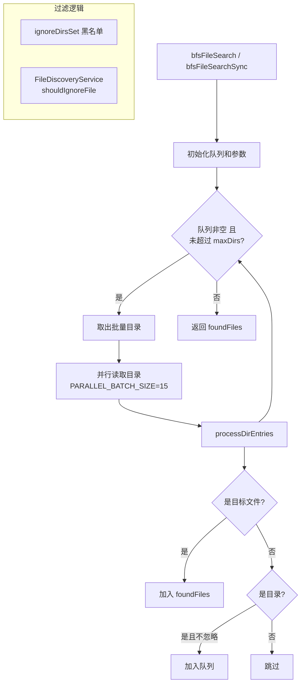

# bfsFileSearch.ts

> 在目录结构中使用广度优先搜索（BFS）查找特定文件

## 概述
该文件实现了异步和同步两种广度优先文件搜索算法，用于在给定的目录树中查找指定名称的文件。支持忽略特定目录、限制扫描目录数量、并行批量读取目录以提高性能，以及通过 `FileDiscoveryService` 尊重 `.gitignore` 和 `.geminiignore` 规则。该文件是文件发现服务的底层搜索实现。

## 架构图

## 主要导出

### `bfsFileSearch(rootDir: string, options: BfsFileSearchOptions): Promise<string[]>`
异步广度优先搜索，支持并行批量目录读取（批大小 15）。

- **参数**: `rootDir` - 搜索起始目录；`options` - 搜索配置
- **返回值**: 匹配文件的完整路径数组

### `bfsFileSearchSync(rootDir: string, options: BfsFileSearchOptions): string[]`
同步版本的广度优先搜索，逐个目录处理。

- **参数/返回值**: 同上（同步版本）

### 接口 `BfsFileSearchOptions`
| 字段 | 类型 | 说明 |
|------|------|------|
| `fileName` | `string` | 要搜索的文件名 |
| `ignoreDirs` | `string[]` | 忽略的目录名列表 |
| `maxDirs` | `number` | 最大扫描目录数 |
| `debug` | `boolean` | 是否输出调试日志 |
| `fileService` | `FileDiscoveryService` | 文件过滤服务 |
| `fileFilteringOptions` | `FileFilteringOptions` | 文件过滤选项 |

## 核心逻辑
- **指针式队列**: 使用 `queueHead` 指针代替 `splice` 避免 O(n) 的数组重索引开销
- **并行批量读取**: 异步版本使用 `Promise.all` 并行读取最多 15 个目录
- **Set 优化**: 将 `ignoreDirs` 转为 Set 实现 O(1) 查找
- **processDirEntries**: 统一处理目录项，过滤忽略目录，匹配文件名，递归添加子目录

## 内部依赖
| 模块 | 说明 |
|------|------|
| `../services/fileDiscoveryService.js` | FileDiscoveryService 类型 |
| `../config/constants.js` | FileFilteringOptions 类型 |
| `./debugLogger.js` | 调试日志记录 |

## 外部依赖
| 依赖 | 说明 |
|------|------|
| `node:fs/promises` | 异步文件系统操作 |
| `node:fs` | 同步文件系统操作 |
| `node:path` | 路径操作 |
