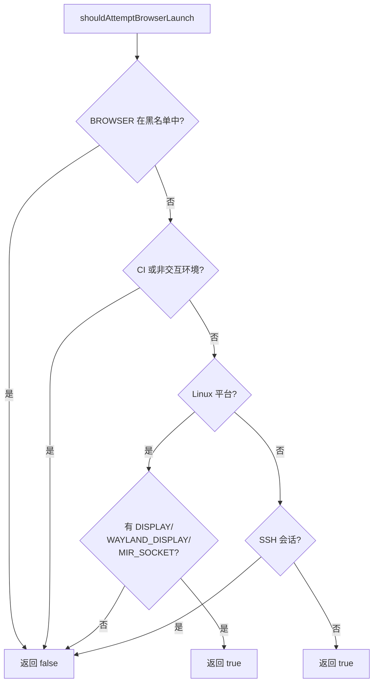

# browser.ts

> 检测当前环境是否适合自动启动浏览器进行认证

## 概述
该文件提供了一个函数，用于判断是否应尝试在用户的环境中启动浏览器。逻辑改编自 Google Cloud SDK，综合考虑了 CI/CD 环境、SSH 远程会话、Linux 显示服务器可用性等因素。该文件是认证流程中浏览器启动决策的核心判断逻辑。

## 架构图

## 主要导出

### `shouldAttemptBrowserLaunch(): boolean`
判断是否应尝试启动浏览器。

- **返回值**: `true` 表示应尝试启动浏览器
- **判断逻辑（按优先级）**:
  1. `BROWSER` 环境变量在黑名单中 -> false
  2. `CI` 或 `DEBIAN_FRONTEND=noninteractive` -> false
  3. Linux 平台无 DISPLAY/WAYLAND_DISPLAY/MIR_SOCKET -> false
  4. SSH 会话且非 Linux 平台 -> false
  5. 其他情况 -> true

## 核心逻辑
- **浏览器黑名单**: `www-browser` 等已知不支持 GUI 的浏览器
- **CI/CD 检测**: 通过 `CI` 和 `DEBIAN_FRONTEND` 环境变量识别
- **SSH 检测**: 通过 `SSH_CONNECTION` 环境变量判断
- **Linux 显示服务器**: 检查 `DISPLAY`、`WAYLAND_DISPLAY`、`MIR_SOCKET` 判断是否有 GUI

## 内部依赖
无

## 外部依赖
无（仅使用 `process.env` 和 `process.platform`）
