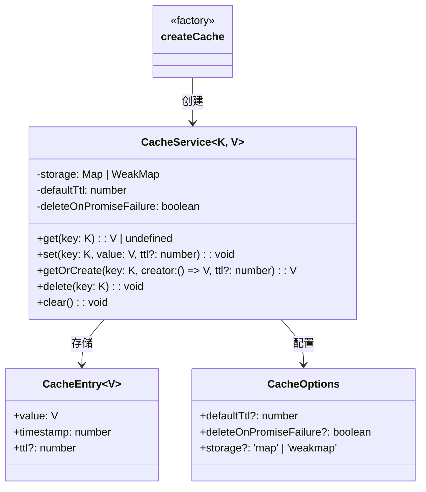

# cache.ts

> 通用缓存服务，支持 TTL（生存时间）、Map/WeakMap 存储和 Promise 失败自动清除

## 概述
该文件实现了一个泛型缓存服务 `CacheService`，支持基于时间的自动过期（TTL）、两种存储后端（Map 和 WeakMap）、以及 Promise 拒绝时自动清除缓存条目的功能。通过工厂函数 `createCache` 提供类型安全的缓存创建接口。该文件是系统中通用缓存基础设施，被多个模块用于避免重复计算或请求。

## 架构图

## 主要导出

### 接口 `CacheEntry<V>`
缓存条目，包含值、时间戳和可选的 TTL。

### 接口 `CacheOptions`
| 字段 | 类型 | 说明 |
|------|------|------|
| `defaultTtl` | `number` | 默认 TTL（毫秒） |
| `deleteOnPromiseFailure` | `boolean` | Promise 拒绝时是否删除条目（默认 true） |
| `storage` | `'map' \| 'weakmap'` | 存储后端类型（默认 map） |

### 类 `CacheService<K, V>`
泛型缓存服务类。

- **`get(key)`**: 获取缓存值，过期则返回 undefined 并删除条目
- **`set(key, value, ttl?)`**: 存储值，可指定条目级 TTL；若值为 Promise 且失败则自动清除
- **`getOrCreate(key, creator, ttl?)`**: 获取或创建缓存值（缓存穿透保护模式）
- **`delete(key)`**: 删除条目
- **`clear()`**: 清空所有条目（仅 Map 存储支持）

### `createCache<K, V>(options?): CacheService<K, V>`
工厂函数，通过函数重载提供类型安全的缓存创建：
- `storage: 'map'` 时允许字符串键
- 默认使用 WeakMap，允许对象键自动垃圾回收

## 核心逻辑
- **TTL 检查**: `get()` 时比较 `Date.now() - entry.timestamp > ttl`，过期自动删除
- **Promise 失败清除**: `set()` 时若值为 Promise，附加 `.catch()` 在拒绝时清除条目（仅在条目未被更新时）
- **存储抽象**: 内部通过类型断言统一 Map 和 WeakMap 的 API 差异

## 内部依赖
无

## 外部依赖
无
