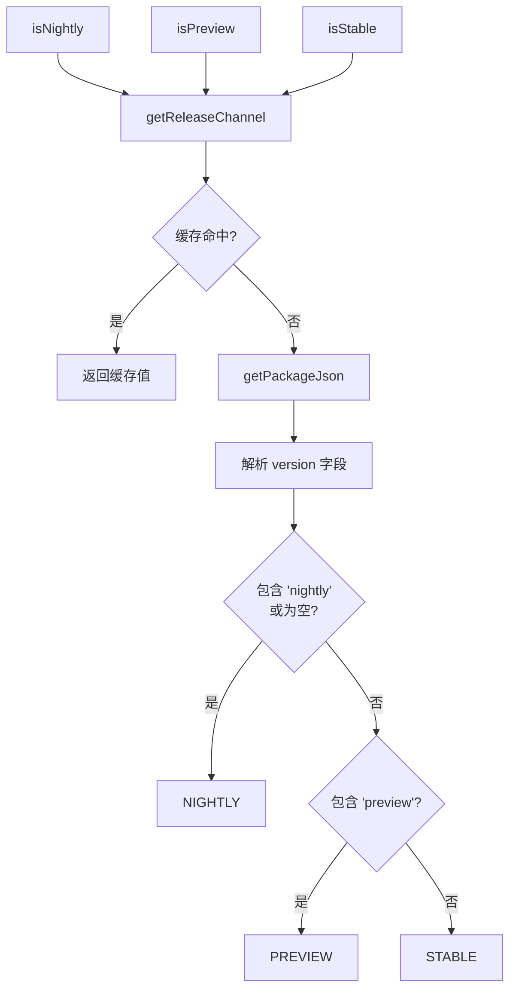

# channel.ts

> 根据 package.json 版本号判断当前发布渠道（nightly/preview/stable）

## 概述
该文件提供了发布渠道检测功能，通过读取 `package.json` 中的版本号来判断当前运行的是 nightly、preview 还是 stable 版本。结果会被缓存以避免重复读取。该文件在模块中用于根据发布渠道启用或禁用特定功能。

## 架构图

## 主要导出

### 枚举 `ReleaseChannel`
| 值 | 说明 |
|------|------|
| `NIGHTLY` | 夜间构建版本 |
| `PREVIEW` | 预览版本 |
| `STABLE` | 稳定版本 |

### `getReleaseChannel(cwd: string): Promise<ReleaseChannel>`
获取当前发布渠道。基于 cwd 缓存结果。

### `isNightly(cwd: string): Promise<boolean>`
判断是否为 nightly 版本。

### `isPreview(cwd: string): Promise<boolean>`
判断是否为 preview 版本。

### `isStable(cwd: string): Promise<boolean>`
判断是否为 stable 版本。

### `_clearCache(): void`
清除缓存（仅供测试使用）。

## 核心逻辑
- 读取 `package.json` 的 `version` 字段
- 版本号包含 `"nightly"` 或为空字符串 -> `NIGHTLY`
- 版本号包含 `"preview"` -> `PREVIEW`
- 其他 -> `STABLE`
- 使用 `Map<string, ReleaseChannel>` 按 cwd 缓存结果

## 内部依赖
| 模块 | 说明 |
|------|------|
| `./package.js` | getPackageJson 读取 package.json |

## 外部依赖
无
