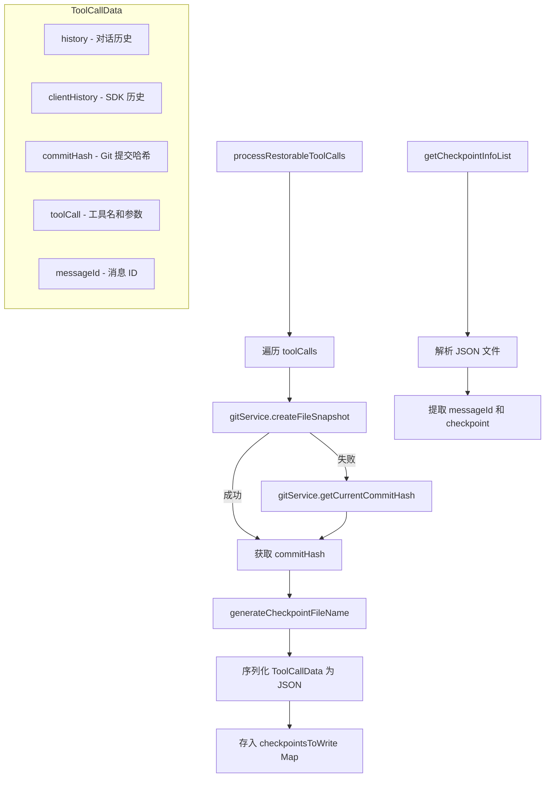

# checkpointUtils.ts

> 工具调用检查点的创建、管理和恢复，支持 Git 快照和历史记录序列化

## 概述
该文件实现了工具调用的检查点（checkpoint）系统。在执行可恢复的工具调用（如文件编辑）前，会创建 Git 快照并将工具调用数据、对话历史、提交哈希等信息序列化为 JSON 文件，以便在需要时恢复到之前的状态。该文件是撤销/恢复功能的核心基础设施。

## 架构图

## 主要导出

### 接口 `ToolCallData<HistoryType, ArgsType>`
检查点数据结构，包含历史记录、提交哈希、工具调用信息和消息 ID。

### `getToolCallDataSchema(historyItemSchema?): ZodObject`
返回 `ToolCallData` 的 Zod 验证 schema。

### `generateCheckpointFileName(toolCall: ToolCallRequestInfo): string | null`
生成检查点文件名，格式为 `{timestamp}-{fileName}-{toolName}`。若工具调用无 `file_path` 参数则返回 null。

### `formatCheckpointDisplayList(filenames: string[]): string`
将检查点文件名列表格式化为显示文本（去除扩展名，换行分隔）。

### `getTruncatedCheckpointNames(filenames: string[]): string[]`
去除文件名扩展名，返回截断后的名称列表。

### `processRestorableToolCalls<HistoryType>(...): Promise<{...}>`
处理可恢复的工具调用列表，为每个调用创建 Git 快照和检查点数据。

- **返回值**: `{ checkpointsToWrite, toolCallToCheckpointMap, errors }`

### 接口 `CheckpointInfo`
检查点信息，包含 `messageId` 和 `checkpoint` 名称。

### `getCheckpointInfoList(checkpointFiles: Map<string, string>): CheckpointInfo[]`
从检查点文件 Map 中解析出检查点信息列表。

## 核心逻辑
- **Git 快照**: 优先通过 `gitService.createFileSnapshot` 创建快照，失败则回退到 `getCurrentCommitHash`
- **文件名生成**: 使用 ISO 时间戳 + 文件名 + 工具名，确保唯一性
- **错误容忍**: 单个工具调用失败不影响其他调用，所有错误收集到 errors 数组

## 内部依赖
| 模块 | 说明 |
|------|------|
| `../services/gitService.js` | Git 操作服务 |
| `../core/client.js` | GeminiClient 获取对话历史 |
| `./errors.js` | getErrorMessage 错误信息提取 |
| `../scheduler/types.js` | ToolCallRequestInfo 类型 |

## 外部依赖
| 依赖 | 说明 |
|------|------|
| `zod` | 数据验证库 |
| `@google/genai` | Content 类型 |
| `node:path` | 路径操作 |
