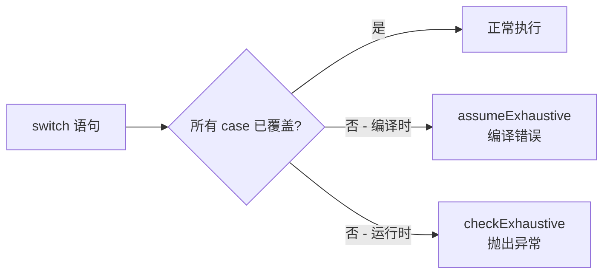

# checks.ts

> 提供 TypeScript 穷尽性检查（exhaustive check）的编译时和运行时保障

## 概述
该文件提供了两个用于 switch 语句穷尽性检查的工具函数。通过 TypeScript 的 `never` 类型，确保 switch 语句覆盖了所有可能的枚举值。如果遗漏了某个值，`assumeExhaustive` 在编译时报错，`checkExhaustive` 则在运行时抛出异常。该文件是类型安全编码模式的基础工具。

## 架构图

## 主要导出

### `assumeExhaustive(_value: never): void`
编译时穷尽性检查。当 `_value` 不是 `never` 类型时，TypeScript 编译器将报错。不执行任何运行时操作。

### `checkExhaustive(value: never, msg?: string): never`
运行时穷尽性检查。先调用 `assumeExhaustive` 进行编译时检查，然后抛出包含未预期值的异常。

- **参数**: `value` - 不应到达此处的值；`msg` - 自定义错误消息
- **返回值**: `never`（始终抛出异常）

## 核心逻辑
- 利用 TypeScript 的 `never` 类型：当所有联合类型分支被处理后，剩余值的类型被收窄为 `never`
- `assumeExhaustive`: 仅编译时生效，函数体为空
- `checkExhaustive`: 既提供编译时检查，又在运行时兜底抛出异常

## 内部依赖
无

## 外部依赖
无
