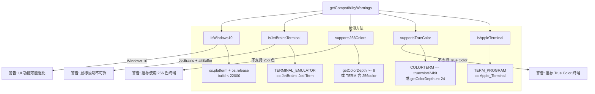

# compatibility.ts

> 检测操作系统和终端兼容性，生成启动时的兼容性警告

## 概述
该文件提供了一系列环境检测函数，用于识别操作系统版本（Windows 10）、终端类型（JetBrains、Apple Terminal）以及颜色支持能力（256 色、True Color）。基于检测结果生成兼容性警告列表，帮助用户了解可能影响体验的环境限制。该文件在应用启动阶段被调用以展示相关提示。

## 架构图

## 主要导出

### `isWindows10(): boolean`
检测是否为 Windows 10（非 Windows 11，区分 build 号 < 22000）。

### `isJetBrainsTerminal(): boolean`
检测是否在 JetBrains IDE 内置终端中运行。

### `isAppleTerminal(): boolean`
检测是否在 macOS 默认的 Terminal.app 中运行。

### `supports256Colors(): boolean`
检测终端是否支持 256 色（8 位色深）。

### `supportsTrueColor(): boolean`
检测终端是否支持 True Color（24 位色深）。

### 枚举 `WarningPriority`
警告优先级：`Low`（低）和 `High`（高）。

### 接口 `StartupWarning`
| 字段 | 类型 | 说明 |
|------|------|------|
| `id` | `string` | 唯一标识符 |
| `message` | `string` | 警告信息 |
| `priority` | `WarningPriority` | 优先级 |

### `getCompatibilityWarnings(options?): StartupWarning[]`
根据当前环境生成兼容性警告列表。

- **参数**: `options.isAlternateBuffer` - 是否使用备用缓冲区模式
- **返回值**: 警告列表

## 核心逻辑
- **Windows 版本区分**: Windows 11 也报告版本号 10.0，通过 build 号 >= 22000 区分
- **颜色检测优先级**: 先检查 `getColorDepth()`，再检查环境变量 `TERM`/`COLORTERM`
- **Apple Terminal 豁免**: True Color 警告不针对 Apple Terminal（已知不支持但不影响使用）
- **平台相关建议**: JetBrains 警告会根据平台推荐不同的终端（Windows Terminal、iTerm2、Ghostty）

## 内部依赖
无

## 外部依赖
| 依赖 | 说明 |
|------|------|
| `node:os` | 操作系统信息 |
