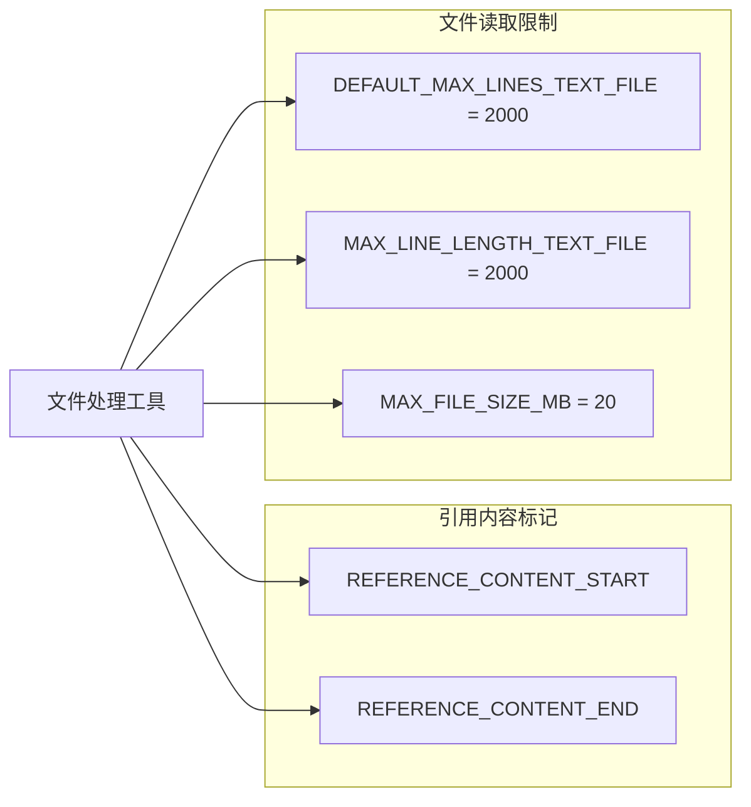

# constants.ts

> 定义文件引用内容和文本文件读取的全局常量

## 概述
该文件集中定义了与文件引用内容格式和文本文件读取限制相关的全局常量。这些常量被文件处理相关的工具和服务引用，确保系统各处使用一致的标记和限制值。该文件在模块中扮演配置中心的角色。

## 架构图

## 主要导出

### `REFERENCE_CONTENT_START: string`
引用文件内容的起始标记：`"--- Content from referenced files ---"`

### `REFERENCE_CONTENT_END: string`
引用文件内容的结束标记：`"--- End of content ---"`

### `DEFAULT_MAX_LINES_TEXT_FILE: number`
文本文件默认最大读取行数：`2000`

### `MAX_LINE_LENGTH_TEXT_FILE: number`
文本文件单行最大字符数：`2000`

### `MAX_FILE_SIZE_MB: number`
文件大小上限（MB）：`20`

## 核心逻辑
纯常量定义文件，无业务逻辑。

## 内部依赖
无

## 外部依赖
无
