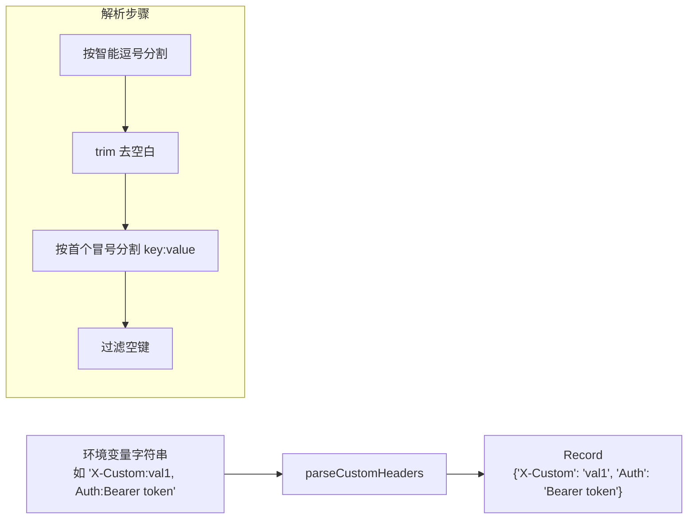

# customHeaderUtils.ts

> 解析自定义 HTTP 头部字符串为键值对映射

## 概述
该文件提供了一个解析函数，用于将环境变量中的自定义 HTTP 头部字符串（逗号分隔的 `key:value` 格式）解析为 `Record<string, string>` 映射。支持值中包含逗号和冒号的复杂场景。该文件用于 API 请求中注入用户自定义头部。

## 架构图

## 主要导出

### `parseCustomHeaders(envValue: string | undefined): Record<string, string>`
解析自定义头部字符串。

- **参数**: `envValue` - 逗号分隔的头部字符串，可为 undefined
- **返回值**: 头部键值对映射，空输入返回空对象
- **分割规则**: 使用正则 `/,(?=\s*[^,:]+:)/` 按「后跟 key: 模式的逗号」分割，避免错误分割值中的逗号

## 核心逻辑
- **智能逗号分割**: 正则表达式利用前瞻断言，仅在逗号后面跟着 `key:` 模式时才分割
- **首个冒号分割**: 使用 `indexOf(':')` 定位第一个冒号，确保值中可包含冒号
- **空值容忍**: 空字符串条目和无键条目被自动跳过

## 内部依赖
无

## 外部依赖
无
