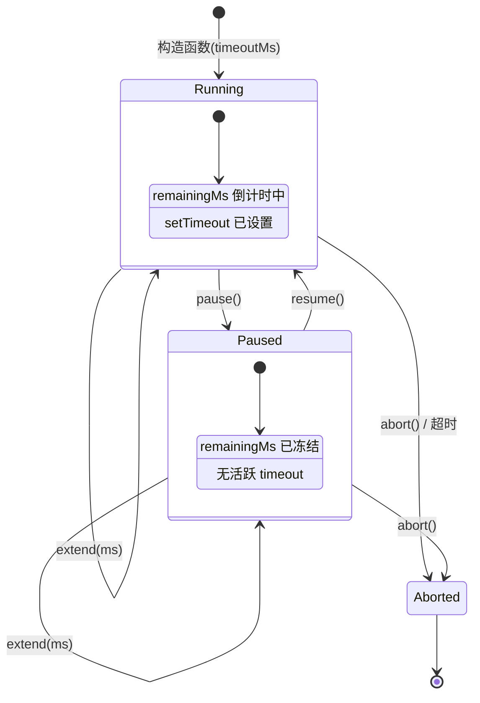

# deadlineTimer.ts

> 可暂停、恢复和动态延长的截止时间定时器，集成 AbortController

## 概述
该文件实现了 `DeadlineTimer` 类，用于管理一个超时定时器及其关联的 `AbortController`。支持暂停/恢复计时、动态延长截止时间等功能，适用于需要灵活超时控制的异步操作场景（如 API 请求、工具执行等）。

## 架构图


## 主要导出

### 类 `DeadlineTimer`

#### 构造函数
```typescript
constructor(timeoutMs: number, reason?: string)
```
创建定时器并立即开始计时。

#### 属性
- **`signal: AbortSignal`** (只读) - 定时器管理的 AbortSignal

#### 方法
| 方法 | 说明 |
|------|------|
| `pause(): void` | 暂停定时器，保留剩余时间 |
| `resume(reason?): void` | 恢复定时器，使用剩余时间继续计时 |
| `extend(ms, reason?): void` | 延长截止时间（暂停状态下直接增加 remainingMs，运行中重新计算并重设 timeout） |
| `abort(reason?): void` | 立即中止信号并清除所有定时器 |

## 核心逻辑
- **时间追踪**: 使用 `lastStartedAt` 和 `remainingMs` 精确追踪已消耗和剩余时间
- **暂停恢复**: `pause()` 时计算已用时间并更新 `remainingMs`；`resume()` 时使用剩余时间重新调度
- **动态延长**: `extend()` 在运行中时先计算已用时间，再加上延长量，重新调度 timeout
- **状态保护**: 所有方法在 `signal.aborted` 后均为空操作

## 内部依赖
无

## 外部依赖
无
