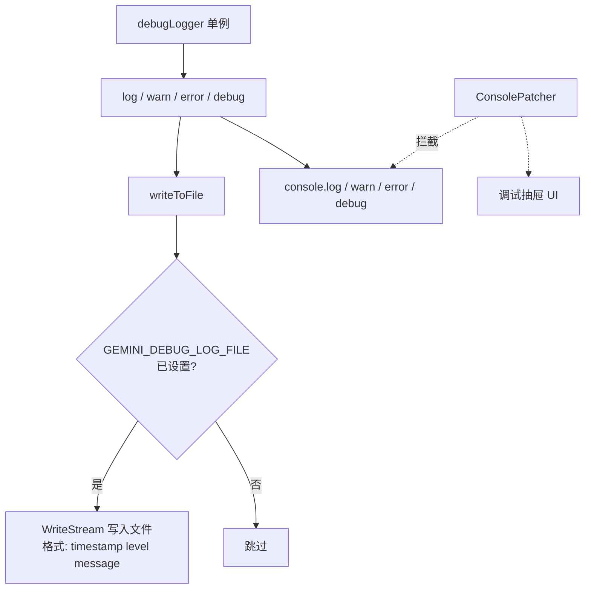

# debugLogger.ts

> 集中式的开发者调试日志记录器，支持控制台输出和文件写入

## 概述
该文件实现了一个简单的集中式调试日志记录器 `DebugLogger`，对原生 `console` 对象进行了薄封装。它提供了明确的「开发者调试日志」语义，使日志意图清晰（面向开发者而非用户），并提供了统一的日志行为控制点。当设置了 `GEMINI_DEBUG_LOG_FILE` 环境变量时，还会同时将日志写入文件。该文件被系统中大量模块引用，是调试基础设施的核心。

## 架构图

## 主要导出

### `debugLogger: DebugLogger`
全局单例调试日志记录器实例。

#### 方法
| 方法 | 说明 |
|------|------|
| `log(...args)` | 普通日志（LOG 级别） |
| `warn(...args)` | 警告日志（WARN 级别） |
| `error(...args)` | 错误日志（ERROR 级别） |
| `debug(...args)` | 调试日志（DEBUG 级别） |

## 核心逻辑
- **双通道输出**: 每次日志调用同时输出到控制台和文件（若配置了文件路径）
- **文件日志格式**: `[ISO时间戳] [级别] 消息\n`
- **文件流错误处理**: WriteStream 的 error 事件会回退到 `console.error`，不会导致应用崩溃
- **环境变量驱动**: 通过 `GEMINI_DEBUG_LOG_FILE` 环境变量配置日志文件路径，追加写入模式

## 内部依赖
无

## 外部依赖
| 依赖 | 说明 |
|------|------|
| `node:fs` | 创建文件写入流 |
| `node:util` | `util.format` 格式化日志参数 |
