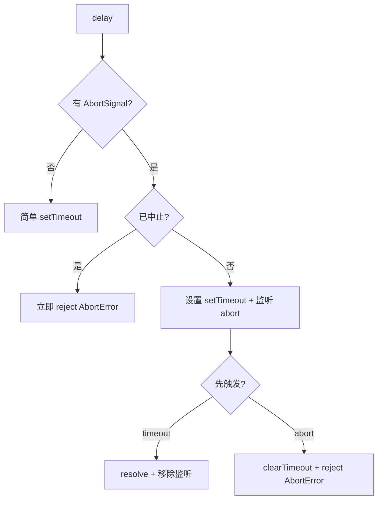

# delay.ts

> 提供可中止的延迟 Promise 工具函数

## 概述
该文件提供了一个支持 `AbortSignal` 的延迟函数和对应的中止错误工厂。用于在重试逻辑、限流等场景中实现可取消的等待。该文件是异步流程控制的基础工具。

## 架构图

## 主要导出

### `createAbortError(): Error`
创建标准的中止错误对象。

- **返回值**: `Error` 对象，`name` 为 `"AbortError"`

### `delay(ms: number, signal?: AbortSignal): Promise<void>`
返回一个在指定毫秒后 resolve 的 Promise，支持通过 AbortSignal 提前取消。

- **参数**: `ms` - 延迟毫秒数；`signal` - 可选的 AbortSignal
- **返回值**: Promise<void>
- **行为**:
  - 无 signal: 简单 `setTimeout` 包装
  - signal 已中止: 立即 reject
  - signal 未中止: 同时监听 timeout 和 abort，先触发者决定结果

## 核心逻辑
- **内存泄漏防护**: 无论是 timeout 先到还是 abort 先到，都会清理对方的监听器
- **AbortSignal.once**: 使用 `{ once: true }` 选项注册事件监听，额外保障清理
- **立即拒绝**: 若 signal 在调用时已处于 aborted 状态，不设置任何定时器直接拒绝

## 内部依赖
无

## 外部依赖
无
