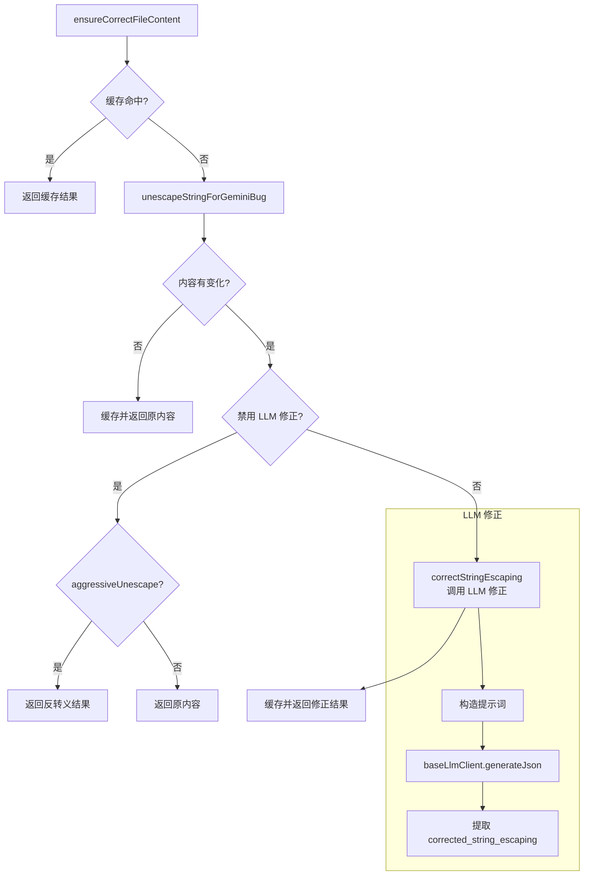

# editCorrector.ts

> 修正 LLM 生成的代码中的转义错误，支持 LLM 辅助修正和本地反转义

## 概述
该文件处理 LLM 生成内容中常见的转义问题（如 `\\n` 应为 `\n`、`\\"` 应为 `"` 等）。提供了三种修正策略：LRU 缓存命中直接返回、本地正则反转义（`unescapeStringForGeminiBug`）、以及调用 LLM 进行智能修正。该文件是编辑工具链中的质量保障层，确保 LLM 输出可以正确应用于目标文件。

## 架构图

## 主要导出

### `ensureCorrectFileContent(content, baseLlmClient, abortSignal, disableLLMCorrection?, aggressiveUnescape?): Promise<string>`
确保文件内容转义正确。

- **参数**:
  - `content` - 待检查内容
  - `baseLlmClient` - LLM 客户端
  - `abortSignal` - 中止信号
  - `disableLLMCorrection` - 禁用 LLM 修正（默认 true）
  - `aggressiveUnescape` - 启用激进反转义（默认 false）
- **返回值**: 修正后的内容

### `correctStringEscaping(str, baseLlmClient, abortSignal): Promise<string>`
使用 LLM 修正字符串转义。通过结构化 JSON 输出要求 LLM 返回修正后的字符串。

### `unescapeStringForGeminiBug(inputString: string): string`
本地正则反转义，处理常见的过度转义模式：
- `\\n` -> `\n`（换行）
- `\\t` -> `\t`（制表符）
- `\\r` -> `\r`（回车）
- `\\'` -> `'`、`\\"` -> `"`、`` \\` `` -> `` ` ``
- `\\\\` -> `\\`

### `resetEditCorrectorCaches_TEST_ONLY(): void`
清空缓存（仅供测试）。

## 核心逻辑
- **LRU 缓存**: 使用 `mnemonist` 的 LRU 缓存（容量 50），避免重复修正相同内容
- **三级修正策略**: 缓存 -> 本地反转义 -> LLM 修正（可配置跳过 LLM）
- **正则反转义**: `/\\+(n|t|r|'|"|`|\\|\n)/g` 匹配一个或多个反斜杠后跟特定字符
- **LLM 结构化输出**: 使用 `generateJson` 要求 LLM 返回 `{ corrected_string_escaping: string }` 格式

## 内部依赖
| 模块 | 说明 |
|------|------|
| `../core/baseLlmClient.js` | BaseLlmClient LLM 客户端 |
| `./promptIdContext.js` | promptIdContext 获取当前提示 ID |
| `./debugLogger.js` | 调试日志 |
| `../telemetry/types.js` | LlmRole 枚举 |

## 外部依赖
| 依赖 | 说明 |
|------|------|
| `@google/genai` | Content 类型 |
| `mnemonist` | LRUCache 实现 |
