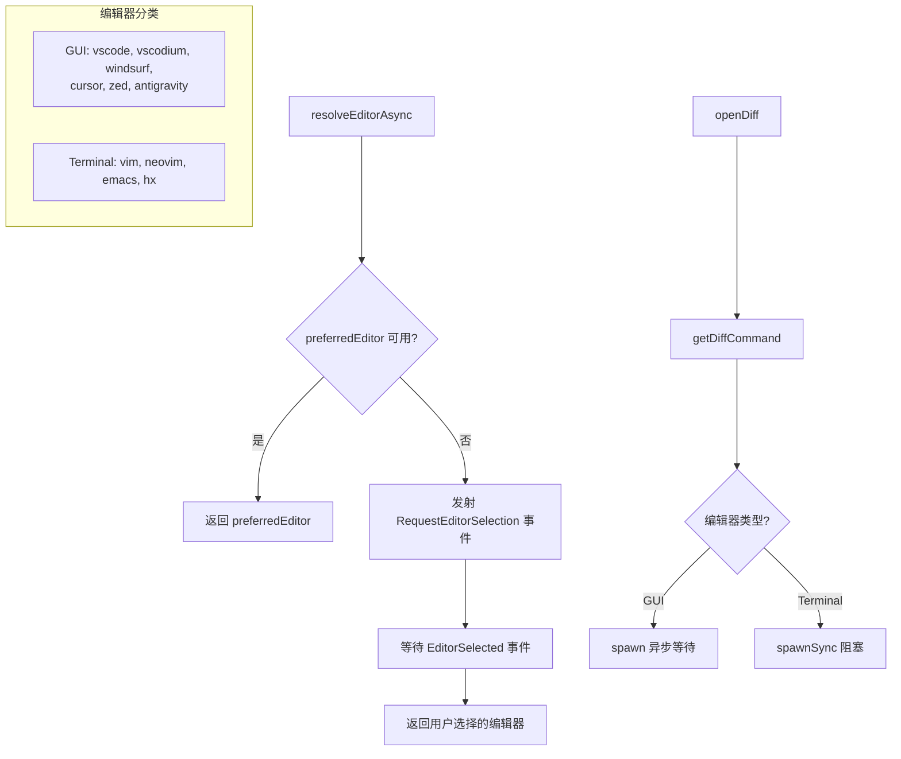

# editor.ts

> 外部编辑器集成管理，支持 GUI 和终端编辑器的检测、启动和 diff 操作

## 概述
该文件实现了完整的外部编辑器集成系统，涵盖编辑器类型定义（GUI 和终端）、命令检测、diff 工具启动、跨平台命令配置等功能。支持 VS Code、Cursor、Vim、Neovim、Emacs、Zed、Helix 等多种编辑器。该文件是编辑/审查工作流的核心基础设施。

## 架构图

## 主要导出

### 类型
- **`GuiEditorType`**: GUI 编辑器类型联合
- **`TerminalEditorType`**: 终端编辑器类型联合
- **`EditorType`**: 所有编辑器类型联合

### 常量
- **`NO_EDITOR_AVAILABLE_ERROR`**: 无可用编辑器的错误消息
- **`DEFAULT_GUI_EDITOR`**: 默认 GUI 编辑器（`"vscode"`）
- **`EDITOR_DISPLAY_NAMES`**: 编辑器显示名映射

### 检测函数
| 函数 | 说明 |
|------|------|
| `isGuiEditor(editor)` | 判断是否为 GUI 编辑器 |
| `isTerminalEditor(editor)` | 判断是否为终端编辑器 |
| `getEditorDisplayName(editor)` | 获取编辑器显示名称 |
| `hasValidEditorCommand(editor)` | 同步检查编辑器命令是否存在 |
| `hasValidEditorCommandAsync(editor)` | 异步版本 |
| `getEditorCommand(editor)` | 获取编辑器可执行命令 |
| `allowEditorTypeInSandbox(editor)` | 检查沙箱中是否允许该编辑器 |
| `isEditorAvailable(editor)` | 同步综合检查编辑器可用性 |
| `isEditorAvailableAsync(editor)` | 异步版本 |

### 核心函数
| 函数 | 说明 |
|------|------|
| `resolveEditorAsync(preferred, signal?)` | 解析编辑器：优先使用首选，否则请求用户选择 |
| `getDiffCommand(oldPath, newPath, editor)` | 获取指定编辑器的 diff 命令及参数 |
| `openDiff(oldPath, newPath, editor)` | 启动编辑器进行双文件 diff 比较 |

## 核心逻辑
- **跨平台命令**: 每个编辑器配置 `win32` 和 `default` 两组命令列表
- **命令探测**: 使用 `command -v`（Unix）或 `where.exe`（Windows）检测命令是否存在
- **Diff 命令配置**: 各编辑器使用不同参数（如 VS Code 用 `--wait --diff`，Vim 用 `-d`，Emacs 用 `ediff`）
- **进程管理**: GUI 编辑器使用 `spawn` 异步等待；终端编辑器使用 `spawnSync` 阻塞进程
- **防重复结算**: `openDiff` 使用 `isSettled` 标志防止 `close` 和 `error` 事件同时触发导致的重复处理
- **Emacs Lisp 转义**: `escapeELispString` 对路径中的反斜杠和引号进行转义

## 内部依赖
| 模块 | 说明 |
|------|------|
| `./debugLogger.js` | 调试日志 |
| `./events.js` | CoreEvent 事件（RequestEditorSelection、EditorSelected、ExternalEditorClosed） |

## 外部依赖
| 依赖 | 说明 |
|------|------|
| `node:child_process` | exec、execSync、spawn、spawnSync |
| `node:util` | promisify |
| `node:events` | once |
