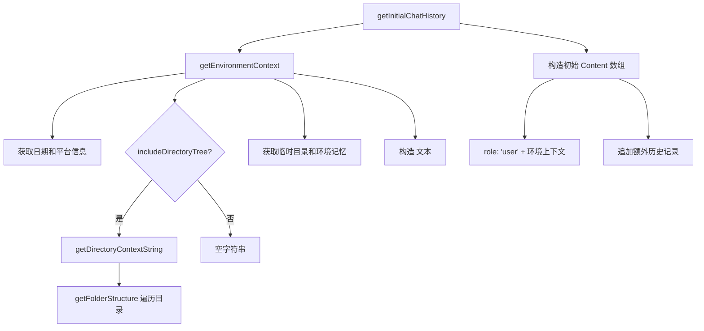

# environmentContext.ts

> 生成会话环境上下文信息，包括工作目录、日期、操作系统和目录结构

## 概述
该文件负责构建聊天会话的初始环境上下文，收集当前工作目录结构、日期、操作系统等信息，将其格式化为结构化文本，作为 LLM 对话的初始上下文。该文件是对话初始化流程的核心组成部分，确保 LLM 了解用户的工作环境。

## 架构图

## 主要导出

### `INITIAL_HISTORY_LENGTH: number`
初始历史记录长度常量，值为 `1`。

### `getDirectoryContextString(config: Config): Promise<string>`
生成工作空间目录上下文字符串。

- **参数**: `config` - 运行时配置
- **返回值**: 包含目录列表和目录结构的 Markdown 格式字符串

### `getEnvironmentContext(config: Config): Promise<Part[]>`
获取环境上下文信息。

- **参数**: `config` - 运行时配置
- **返回值**: 包含 `<session_context>` 标签的 Part 数组
- **包含信息**: 日期（本地化格式）、操作系统、临时目录、目录结构、环境记忆

### `getInitialChatHistory(config: Config, extraHistory?: Content[]): Promise<Content[]>`
构建初始聊天历史。

- **参数**: `config` - 运行时配置；`extraHistory` - 额外的历史记录
- **返回值**: 以环境上下文为首条消息的 Content 数组

## 核心逻辑
- **目录结构获取**: 通过 `getFolderStructure` 并行获取所有工作空间目录的结构
- **日期本地化**: 使用 `toLocaleDateString` 按用户区域设置格式化日期
- **上下文模板**: 使用 `<session_context>` XML 标签包裹环境信息
- **条件性目录树**: 根据配置 `getIncludeDirectoryTree()` 决定是否包含目录结构

## 内部依赖
| 模块 | 说明 |
|------|------|
| `../config/config.js` | Config 运行时配置 |
| `./getFolderStructure.js` | 获取目录结构 |

## 外部依赖
| 依赖 | 说明 |
|------|------|
| `@google/genai` | Part、Content 类型 |
