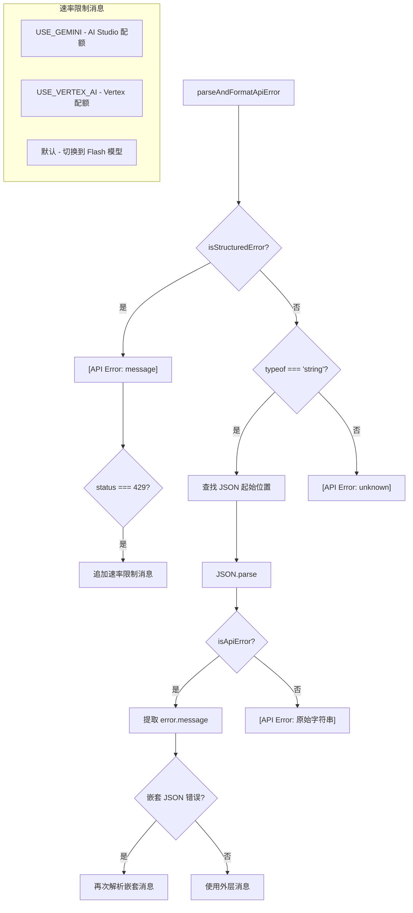

# errorParsing.ts

> 解析和格式化 API 错误消息，支持嵌套 JSON 错误和速率限制提示

## 概述
该文件专注于解析来自 API 的各类错误格式，包括结构化错误对象、JSON 字符串中嵌套的错误、以及未知格式错误，并将其转换为用户友好的格式化字符串。特别处理了 429 速率限制错误，根据认证类型（Gemini/Vertex/默认）提供不同的建议消息。

## 架构图

## 主要导出

### `parseAndFormatApiError(error, authType?, userTier?, currentModel?, fallbackModel?): string`
解析并格式化 API 错误。

- **参数**:
  - `error` - 原始错误（可为对象或字符串）
  - `authType` - 认证类型（决定速率限制消息内容）
  - `userTier` - 用户层级
  - `currentModel` - 当前模型
  - `fallbackModel` - 备选模型
- **返回值**: 格式化的错误字符串，如 `"[API Error: message (Status: 429)]"`

## 核心逻辑
- **三路分派**: 结构化错误 -> 字符串错误 -> 未知错误
- **字符串错误解析**: 在字符串中查找 `{` 起始位置，提取 JSON 子串并解析
- **嵌套错误处理**: 尝试对 `error.message` 再次 JSON 解析，处理双层嵌套的错误结构
- **速率限制分流**: 根据 `AuthType` 提供不同的配额提升建议
- **容错设计**: 所有 JSON.parse 都包裹在 try-catch 中，解析失败时回退到原始消息

## 内部依赖
| 模块 | 说明 |
|------|------|
| `./quotaErrorDetection.js` | isApiError、isStructuredError 类型守卫 |
| `../config/models.js` | DEFAULT_GEMINI_FLASH_MODEL 默认模型 |
| `../code_assist/types.js` | UserTierId 类型 |
| `../core/contentGenerator.js` | AuthType 枚举 |

## 外部依赖
无
