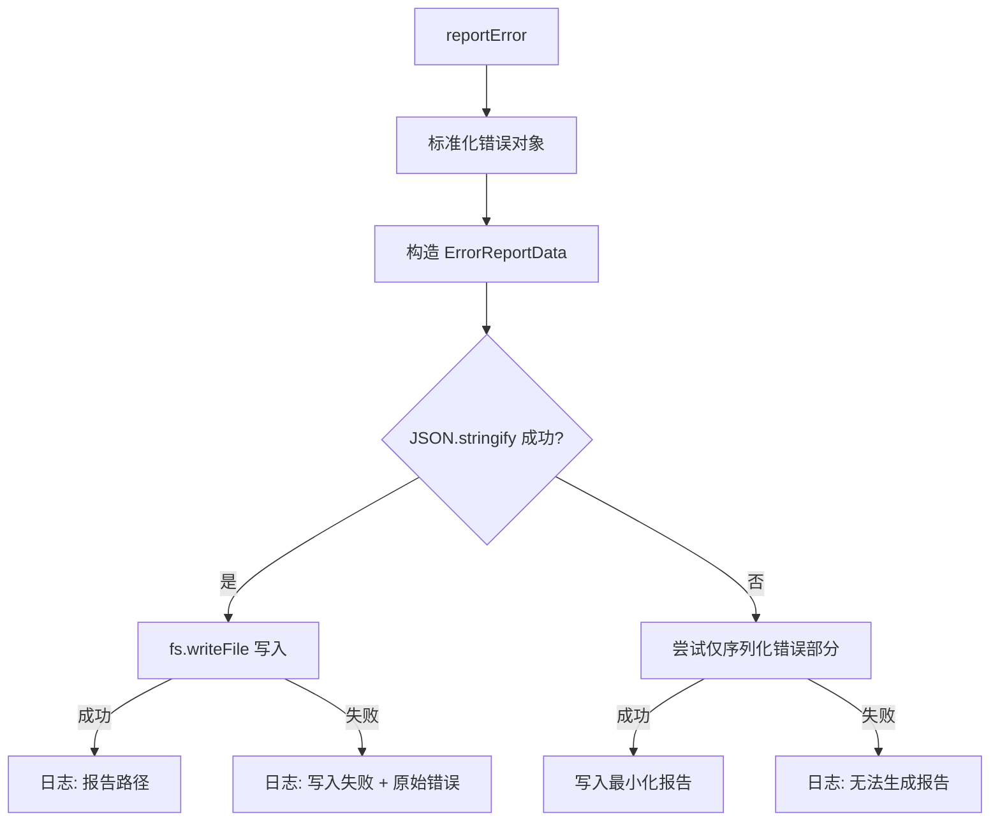

# errorReporting.ts

> 生成结构化错误报告并写入临时文件，支持多级容错回退

## 概述
该文件实现了错误报告生成功能，将错误信息、上下文数据序列化为 JSON 文件并写入临时目录。采用多级容错策略：完整报告失败时尝试最小化报告，写入失败时回退到控制台输出。该文件是错误诊断和调试的重要基础设施。

## 架构图

## 主要导出

### `reportError(error, baseMessage, context?, type?, reportingDir?): Promise<void>`
生成错误报告并写入文件。

- **参数**:
  - `error` - 错误对象（Error 或 unknown）
  - `baseMessage` - 日志前缀消息
  - `context` - 相关上下文（对话历史、请求内容等）
  - `type` - 错误类型标识（默认 `"general"`）
  - `reportingDir` - 报告目录（默认 `os.tmpdir()`，测试时可覆盖）
- **文件名格式**: `gemini-client-error-{type}-{timestamp}.json`

## 核心逻辑
- **错误标准化**: 支持 Error 实例（提取 message + stack）、带 message 属性的对象、以及任意值（String 转换）
- **多级容错**:
  1. 尝试完整报告（错误 + 上下文）
  2. JSON.stringify 失败（如 BigInt）-> 尝试仅错误的最小化报告
  3. 写入失败 -> 回退到 console 输出
  4. context 日志失败 -> 尝试截断版本（1000 字符）
  5. 截断也失败 -> 记录「无法日志化上下文」
- **时间戳文件名**: ISO 时间戳中的 `:` 和 `.` 替换为 `-`

## 内部依赖
| 模块 | 说明 |
|------|------|
| `./debugLogger.js` | 日志输出 |

## 外部依赖
| 依赖 | 说明 |
|------|------|
| `node:fs/promises` | 异步文件写入 |
| `node:os` | os.tmpdir() 获取临时目录 |
| `node:path` | 路径拼接 |
| `@google/genai` | Content 类型 |
