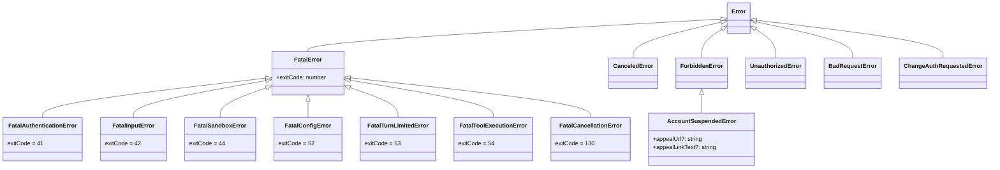

# errors.ts

> 定义全局错误类型体系和错误处理工具函数，涵盖认证、权限、取消等场景

## 概述
该文件是系统的错误类型中心，定义了丰富的自定义错误类层次结构（FatalError 家族、ForbiddenError 家族等）和一系列错误处理工具函数。包括错误消息提取、错误类型识别、Gaxios HTTP 错误解析、Google API 结构化错误（TOS_VIOLATION 检测）等。该文件是整个错误处理架构的基础，被系统中几乎所有模块引用。

## 架构图

## 主要导出

### 错误类
| 类 | 退出码 | 说明 |
|------|------|------|
| `FatalError` | 自定义 | 致命错误基类 |
| `FatalAuthenticationError` | 41 | 认证失败 |
| `FatalInputError` | 42 | 输入错误 |
| `FatalSandboxError` | 44 | 沙箱错误 |
| `FatalConfigError` | 52 | 配置错误 |
| `FatalTurnLimitedError` | 53 | 对话轮次超限 |
| `FatalToolExecutionError` | 54 | 工具执行致命错误 |
| `FatalCancellationError` | 130 | 用户取消（SIGINT） |
| `CanceledError` | - | 操作被取消 |
| `ForbiddenError` | - | 403 禁止访问 |
| `AccountSuspendedError` | - | 账号被暂停（含申诉链接） |
| `UnauthorizedError` | - | 401 未授权 |
| `BadRequestError` | - | 400 请求错误 |
| `ChangeAuthRequestedError` | - | 用户请求更换认证方式 |

### 工具函数
| 函数 | 说明 |
|------|------|
| `isNodeError(error)` | 判断是否为 Node.js errno 异常 |
| `isAbortError(error)` | 判断是否为 AbortError |
| `getErrorMessage(error)` | 提取错误消息字符串 |
| `getErrorType(error)` | 获取错误类型名称 |
| `toFriendlyError(error)` | 将底层错误转为用户友好的错误类型 |
| `isAccountSuspendedError(error)` | 检测并返回 AccountSuspendedError |
| `isAuthenticationError(error)` | 检测是否为 401 认证错误 |

## 核心逻辑
- **toFriendlyError**:
  1. 先通过 `parseGoogleApiError` 进行结构化解析，检测 TOS_VIOLATION -> `AccountSuspendedError`
  2. 再通过 Gaxios 错误解析 HTTP 状态码 400/401/403
  3. 无法识别则返回原始错误
- **isAuthenticationError**: 多路径检测 401 错误：MCP SDK 的 code 属性、UnauthorizedError 类名、消息中包含 "401"
- **getErrorMessage**: 多级降级：Error.message -> 对象.message -> String() -> 兜底字符串

## 内部依赖
| 模块 | 说明 |
|------|------|
| `./googleErrors.js` | parseGoogleApiError、ErrorInfo 类型 |

## 外部依赖
无
