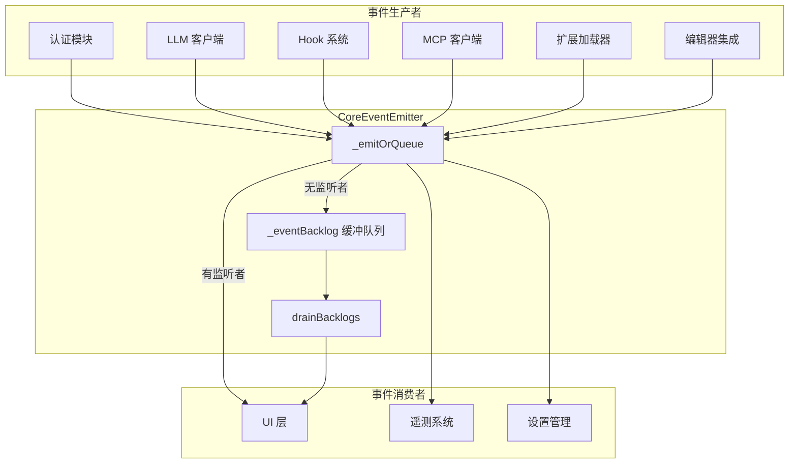

# events.ts

> 核心事件系统，定义全局事件类型、负载接口和带缓冲的事件发射器

## 概述
该文件是整个应用的事件总线，定义了所有核心事件类型（`CoreEvent` 枚举）、各事件的负载接口（Payload），以及自定义的 `CoreEventEmitter` 类。`CoreEventEmitter` 扩展了 Node.js 的 `EventEmitter`，增加了事件积压缓冲机制——当某个事件尚无监听者时，自动将其排入缓冲队列，待 UI 订阅后批量排空。该文件是模块间解耦通信的核心基础设施，被几乎所有子系统引用。

## 架构图

## 主要导出

### 枚举 `CoreEvent`
| 事件名 | 说明 |
|--------|------|
| `UserFeedback` | 用户反馈消息（info/warning/error） |
| `ModelChanged` | 模型切换 |
| `ConsoleLog` | 控制台日志 |
| `Output` | stdout/stderr 输出 |
| `MemoryChanged` | 记忆文件变更 |
| `ExternalEditorClosed` | 外部编辑器关闭 |
| `McpClientUpdate` | MCP 客户端更新 |
| `OauthDisplayMessage` | OAuth 显示消息 |
| `SettingsChanged` | 设置变更 |
| `HookStart` / `HookEnd` | Hook 执行开始/结束 |
| `AgentsRefreshed` | Agent 列表刷新 |
| `AdminSettingsChanged` | 管理员设置变更 |
| `RetryAttempt` | 重试尝试 |
| `ConsentRequest` | 用户同意请求 |
| `McpProgress` | MCP 工具进度 |
| `AgentsDiscovered` | 新 Agent 发现 |
| `RequestEditorSelection` / `EditorSelected` | 编辑器选择请求/确认 |
| `SlashCommandConflicts` | 斜杠命令冲突 |
| `QuotaChanged` | 配额变更 |
| `TelemetryKeychainAvailability` | Keychain 可用性 |
| `TelemetryTokenStorageType` | Token 存储类型 |

### 负载接口
文件定义了与每个事件对应的 Payload 接口（共 15+ 个），如 `UserFeedbackPayload`、`ModelChangedPayload`、`RetryAttemptPayload`、`McpProgressPayload` 等。

### 类 `CoreEventEmitter`
继承 `EventEmitter<CoreEvents>`，增加以下功能：

#### 缓冲机制
- **`_emitOrQueue(event, ...args)`**: 有监听者则直接 emit，否则入缓冲队列
- **`_eventBacklog`**: 缓冲队列，最大容量 10000
- **`drainBacklogs()`**: 排空缓冲队列（UI 订阅后调用）
- 使用 head 指针避免频繁 `shift()` 的 O(n) 开销，超过半容量时才 compact

#### 便捷 emit 方法
| 方法 | 是否缓冲 | 说明 |
|------|----------|------|
| `emitFeedback(severity, message, error?)` | 是 | 用户反馈 |
| `emitConsoleLog(type, content)` | 是 | 控制台日志 |
| `emitOutput(isStderr, chunk, encoding?)` | 是 | 标准输出 |
| `emitConsentRequest(payload)` | 是 | 同意请求 |
| `emitAgentsDiscovered(agents)` | 是 | Agent 发现 |
| `emitSlashCommandConflicts(conflicts)` | 是 | 命令冲突 |
| `emitModelChanged(model)` | 否 | 模型变更 |
| `emitSettingsChanged()` | 否 | 设置变更 |
| `emitHookStart/End(payload)` | 否 | Hook 事件 |
| `emitRetryAttempt(payload)` | 否 | 重试 |
| `emitMcpProgress(payload)` | 否 | MCP 进度（含有效性校验） |
| `emitQuotaChanged(remaining, limit, resetTime?)` | 否 | 配额变更 |

### `coreEvents: CoreEventEmitter`
全局单例事件发射器。

## 核心逻辑
- **缓冲队列**: 解决 UI 层晚于核心模块初始化导致早期事件丢失的问题
- **指针式队列管理**: `_backlogHead` 指针避免 `shift()` 的 O(n) 开销；当死条目超过半容量时 slice compact
- **最大容量保护**: 缓冲队列上限 10000，溢出时淘汰最旧条目
- **MCP 进度校验**: `emitMcpProgress` 验证 progress 值的有效性（有限数且非负）
- **类型安全**: 通过 `CoreEvents` 接口和泛型 `EventEmitter<CoreEvents>` 实现完整的事件类型推断

## 内部依赖
| 模块 | 说明 |
|------|------|
| `../agents/types.js` | AgentDefinition 类型 |
| `../tools/mcp-client.js` | McpClient 类型 |
| `./extensionLoader.js` | ExtensionEvents 接口 |
| `./editor.js` | EditorType 类型 |
| `../telemetry/types.js` | 遥测事件类型 |
| `./debugLogger.js` | 调试日志 |

## 外部依赖
| 依赖 | 说明 |
|------|------|
| `node:events` | EventEmitter 基类 |
