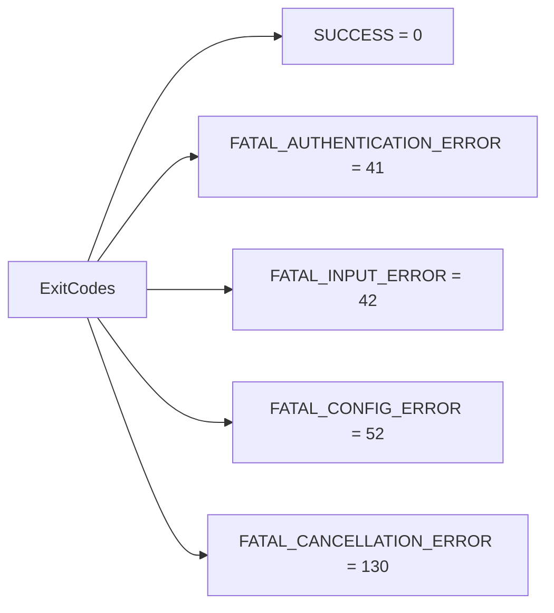

# exitCodes.ts

> 定义进程退出码常量

## 概述
该文件集中定义了 CLI 进程的退出码常量，确保不同退出场景使用一致的退出码。与 `errors.ts` 中各 FatalError 子类的退出码对应。该文件提供了一个只读常量对象，便于其他模块引用标准退出码。

## 架构图

## 主要导出

### `ExitCodes` (只读常量对象)
| 常量 | 值 | 说明 |
|------|------|------|
| `SUCCESS` | 0 | 成功退出 |
| `FATAL_AUTHENTICATION_ERROR` | 41 | 认证致命错误 |
| `FATAL_INPUT_ERROR` | 42 | 输入致命错误 |
| `FATAL_CONFIG_ERROR` | 52 | 配置致命错误 |
| `FATAL_CANCELLATION_ERROR` | 130 | 用户取消（SIGINT 标准码） |

## 核心逻辑
纯常量定义文件，使用 `as const` 确保类型为字面量类型。

## 内部依赖
无

## 外部依赖
无
