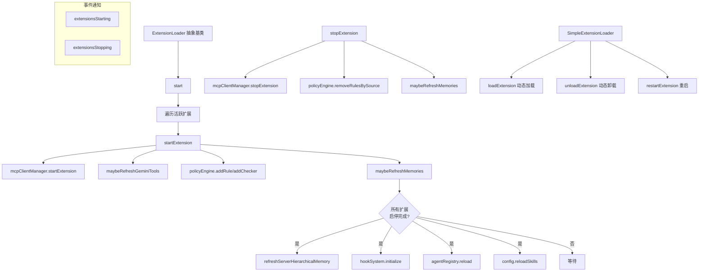

# extensionLoader.ts

> 扩展生命周期管理器，负责扩展的启动、停止、重启和动态加载/卸载

## 概述
该文件定义了扩展加载器的抽象基类 `ExtensionLoader` 和具体实现 `SimpleExtensionLoader`，管理 Gemini CLI 扩展的完整生命周期。每个扩展可以注册 MCP 服务器、策略规则/检查器、工具排除列表等功能。加载器在所有扩展启停完成后统一刷新记忆、Hook 系统和 Agent 注册表，以减少不必要的重复刷新。该文件是扩展系统的核心管理基础设施。

## 架构图

## 主要导出

### 抽象类 `ExtensionLoader`

#### 抽象方法
- **`getExtensions(): GeminiCLIExtension[]`** - 获取所有已知扩展

#### 公共方法
| 方法 | 说明 |
|------|------|
| `start(config)` | 初始化所有活跃扩展（只能调用一次） |
| `restartExtension(extension)` | 重启指定扩展（停止后启动） |

#### 受保护方法
| 方法 | 说明 |
|------|------|
| `startExtension(extension)` | 无条件启动扩展（注册 MCP、策略、工具） |
| `stopExtension(extension)` | 无条件停止扩展（注销 MCP、策略） |
| `maybeStartExtension(extension)` | 条件启动（需扩展重载启用且已初始化） |
| `maybeStopExtension(extension)` | 条件停止 |

### 类 `SimpleExtensionLoader`
`ExtensionLoader` 的具体实现，支持动态加载/卸载。

| 方法 | 说明 |
|------|------|
| `getExtensions()` | 返回扩展列表 |
| `loadExtension(extension)` | 添加并启动扩展 |
| `unloadExtension(extension)` | 移除并停止扩展 |

### 接口 `ExtensionEvents`
| 事件 | 负载 | 说明 |
|------|------|------|
| `extensionsStarting` | `{ total, completed }` | 扩展启动进度 |
| `extensionsStopping` | `{ total, completed }` | 扩展停止进度 |

### 接口 `ExtensionsStartingEvent` / `ExtensionsStoppingEvent`
包含 `total`（总数）和 `completed`（已完成数）字段。

## 核心逻辑
- **单次初始化保护**: `start()` 只能调用一次，重复调用抛出异常
- **计数器追踪**: 使用 `startingCount`/`startCompletedCount` 和 `stoppingCount`/`stopCompletedCount` 追踪启停进度
- **延迟刷新**: `maybeRefreshMemories` 仅在所有扩展启停完成且不在首次 `start()` 中时执行，避免不必要的重复刷新和 context cache 失效
- **策略注销**: 停止扩展时通过 `source` 标识符批量移除该扩展注册的所有规则和检查器
- **工具刷新**: 仅当扩展有 `excludeTools` 配置时才刷新工具列表

## 内部依赖
| 模块 | 说明 |
|------|------|
| `../config/config.js` | Config、GeminiCLIExtension 类型 |
| `./memoryDiscovery.js` | refreshServerHierarchicalMemory |

## 外部依赖
| 依赖 | 说明 |
|------|------|
| `node:events` | EventEmitter 类型 |
