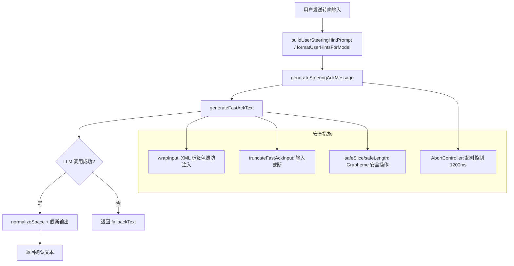

# fastAckHelper.ts

> 提供快速确认（Fast Ack）文本生成能力，用于在任务执行期间对用户输入进行即时响应

## 概述
`fastAckHelper.ts` 实现了一个轻量级的 LLM 辅助文本生成系统，专门用于在主模型处理长时间任务时，快速生成简短的确认消息来响应用户的"转向"（steering）输入。其设计动机是提升用户体验——当用户在任务执行中途发送指令调整时，系统能在毫秒级别给出友好的回复，而非让用户等待主流程完成。该文件在模块中扮演"即时反馈层"的角色，被任务编排器调用以生成转向确认消息和用户提示格式化文本。

## 架构图

## 主要导出

### 常量
- **`DEFAULT_FAST_ACK_MODEL_CONFIG_KEY`**: `ModelConfigKey` — 快速确认模型的配置键，值为 `{ model: 'fast-ack-helper' }`
- **`DEFAULT_MAX_INPUT_CHARS`**: `number` — 输入最大字符数，默认 1200
- **`DEFAULT_MAX_OUTPUT_CHARS`**: `number` — 输出最大字符数，默认 180
- **`USER_STEERING_INSTRUCTION`**: `string` — 用户转向指令的系统提示文本，指导模型对转向进行分类（ADD/MODIFY/CANCEL_TASK 或 EXTRA_CONTEXT）

### 函数
- **`normalizeSpace(text: string): string`** — 将连续空白字符合并为单个空格并去除首尾空白
- **`buildUserSteeringHintPrompt(hintText: string): string`** — 构建用户转向提示的完整 prompt，包含 XML 包裹和转向指令
- **`formatUserHintsForModel(hints: string[]): string | null`** — 将多条用户提示格式化为模型可消费的文本，无提示时返回 null
- **`generateSteeringAckMessage(llmClient: BaseLlmClient, hintText: string): Promise<string>`** — 使用 LLM 生成转向确认消息，超时 1200ms，失败时返回 fallback
- **`truncateFastAckInput(input: string, maxInputChars?: number): string`** — Grapheme 安全的输入截断，超长时追加 `...[truncated]`
- **`generateFastAckText(llmClient: BaseLlmClient, options: GenerateFastAckTextOptions): Promise<string>`** — 核心生成函数，调用 LLM 生成快速确认文本

### 接口
- **`GenerateFastAckTextOptions`** — 快速确认生成选项，包含 instruction、input、fallbackText、abortSignal、promptId 等字段

## 核心逻辑
1. **Grapheme 安全处理**：使用 `Intl.Segmenter` API 进行字符串切片和长度计算（`safeSlice` / `safeLength`），确保多字节字符（如 emoji）不会被截断为乱码。
2. **超时机制**：`generateSteeringAckMessage` 设置 1200ms 硬超时，通过 `AbortController` 取消 LLM 请求，确保用户不会等待过久。
3. **防注入保护**：`wrapInput` 用 `<user_input>` XML 标签包裹用户输入，降低 prompt 注入风险。
4. **优雅降级**：所有 LLM 调用都有 `fallbackText`，在超时、空响应或异常时返回预构建的 fallback 消息（如 `"Understood. Adjusting the plan."`）。
5. **输出限制**：LLM 响应超过 `maxOutputChars` 时进行 Grapheme 安全截断。

## 内部依赖
- `../telemetry/llmRole.js` — `LlmRole` 枚举
- `../core/baseLlmClient.js` — `BaseLlmClient` 类型
- `../services/modelConfigService.js` — `ModelConfigKey` 类型
- `./debugLogger.js` — 调试日志
- `./partUtils.js` — `getResponseText` 提取响应文本
- `./errors.js` — `getErrorMessage` 错误消息提取

## 外部依赖
- `Intl.Segmenter`（ECMAScript 内置）— Grapheme 分段器
