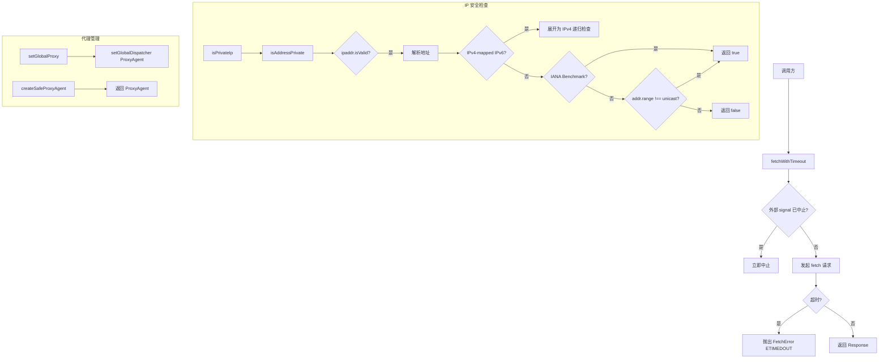

# fetch.ts

> 提供安全的 HTTP 请求工具函数，包含超时控制、代理支持和私有 IP 地址检测

## 概述
`fetch.ts` 是网络请求的安全基础设施层，封装了 Node.js 原生 `fetch` 并增加了超时控制能力，同时提供了完整的 IP 地址安全检查机制来防止 SSRF（Server-Side Request Forgery）攻击。它还通过 `undici` 库配置全局 HTTP 代理，统一管理所有出站请求的网络行为。该文件在模块中作为所有外部 HTTP 通信的底层入口点。

## 架构图

## 主要导出

### 类
- **`FetchError extends Error`** — 自定义请求错误类，包含可选的 `code` 字段（如 `'ETIMEDOUT'`）

### 函数
- **`sanitizeHostname(hostname: string): string`** — 去除 IPv6 地址的方括号包裹
- **`isLoopbackHost(hostname: string): boolean`** — 判断主机名是否为本地回环地址（localhost / 127.0.0.1 / ::1）
- **`isPrivateIp(url: string): boolean`** — 判断 URL 的主机是否为私有 IP 地址
- **`isAddressPrivate(address: string): boolean`** — 判断 IP 地址字符串是否位于私有或保留地址范围
- **`createSafeProxyAgent(proxyUrl: string): ProxyAgent`** — 创建 undici 代理 Agent
- **`fetchWithTimeout(url: string, timeout: number, options?: RequestInit): Promise<Response>`** — 带超时控制的 fetch 封装
- **`setGlobalProxy(proxy: string): void`** — 设置全局 HTTP 代理

## 核心逻辑
1. **全局分发器初始化**：模块加载时通过 `setGlobalDispatcher` 配置默认 Agent，headersTimeout 和 bodyTimeout 均为 5 分钟。
2. **超时控制**：`fetchWithTimeout` 使用独立的 `AbortController`，同时监听外部传入的 `signal`，任一触发即中止请求。
3. **SSRF 防护**：`isAddressPrivate` 综合检查 localhost、IPv4-mapped IPv6 地址展开、IANA Benchmark 测试段（198.18.0.0/15）以及 ipaddr.js 的 `range()` 判断（非 unicast 即私有）。
4. **IANA Benchmark 段特殊处理**：ipaddr.js 将 198.18.0.0/15 分类为 `unicast`，但该段实为保留段，`isBenchmarkAddress` 显式将其标记为私有。

## 内部依赖
- `./errors.js` — `getErrorMessage`、`isNodeError` 错误处理工具

## 外部依赖
- `undici` — `Agent`、`ProxyAgent`、`setGlobalDispatcher` 全局 HTTP 调度器
- `ipaddr.js` — IP 地址解析与范围判断
- `node:url` — `URL` 类
