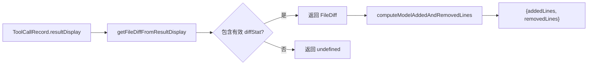

# fileDiffUtils.ts

> 从工具调用记录中提取和计算文件差异统计信息

## 概述
`fileDiffUtils.ts` 提供了两个简洁的工具函数，用于从工具调用记录（`ToolCallRecord`）的 `resultDisplay` 中安全地提取 `FileDiff` 对象，并计算模型添加和删除的代码行数。该文件在模块中服务于聊天记录和遥测系统，支撑文件变更的统计汇总功能。

## 架构图

## 主要导出

### 函数
- **`getFileDiffFromResultDisplay(resultDisplay: ToolCallRecord['resultDisplay']): FileDiff | undefined`** — 从 `resultDisplay` 中安全提取 `FileDiff` 对象，通过运行时类型检查确保结构合法
- **`computeModelAddedAndRemovedLines(stats: DiffStat | undefined): { addedLines: number; removedLines: number }`** — 从 `DiffStat` 中提取模型添加/删除行数，未定义时返回 `{0, 0}`

## 核心逻辑
- `getFileDiffFromResultDisplay` 进行逐层运行时类型检查（非 null、是 object、包含 `diffStat` 字段且 `diffStat` 为非 null 对象），避免在 TypeScript 类型转换中产生运行时错误。
- `computeModelAddedAndRemovedLines` 是简单的字段映射，将 `DiffStat` 的 `model_added_lines` / `model_removed_lines` 映射为更友好的命名。

## 内部依赖
- `../tools/tools.js` — `DiffStat`、`FileDiff` 类型
- `../services/chatRecordingService.js` — `ToolCallRecord` 类型

## 外部依赖
无
