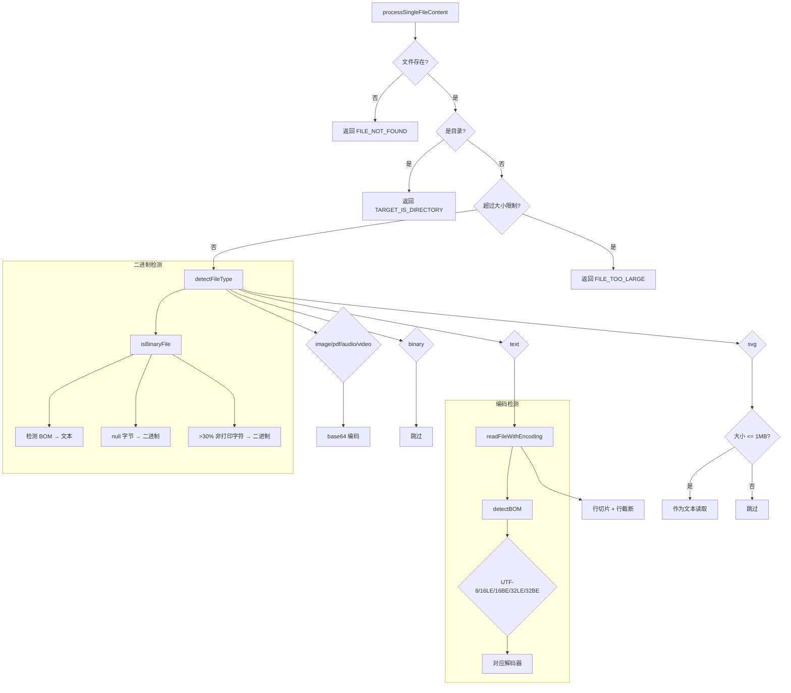

# fileUtils.ts

> 综合文件操作工具集，涵盖编码检测、二进制判断、文件类型识别、内容读取处理及截断输出管理

## 概述
`fileUtils.ts` 是核心模块中最重要的文件处理工具集之一（约 647 行），提供了从底层字节编码检测到高层文件内容处理的完整链路。其设计动机是让 LLM 工具能安全、高效地读取各种格式的文件（文本、图片、PDF、音视频、二进制），并将其转换为模型可消费的格式。该文件在模块中扮演"文件 I/O 中间件"的角色，被 `read_file`、`read_many_files` 等工具广泛依赖。

## 架构图

## 主要导出

### 常量
- **`DEFAULT_ENCODING`**: `'utf-8'` — 默认文件编码
- **`TOOL_OUTPUTS_DIR`**: `'tool-outputs'` — 工具输出临时目录名

### 函数
- **`readWasmBinaryFromDisk(specifier: string): Promise<Uint8Array>`** — 从磁盘读取 WASM 二进制文件
- **`loadWasmBinary(dynamicImport, fallbackSpecifier): Promise<Uint8Array>`** — 优先动态导入 WASM，失败则从磁盘回退读取
- **`detectBOM(buf: Buffer): BOMInfo | null`** — 检测 Unicode BOM（支持 UTF-8/16LE/16BE/32LE/32BE）
- **`readFileWithEncoding(filePath: string): Promise<string>`** — BOM 感知的文件读取，自动检测编码并剥离 BOM
- **`getSpecificMimeType(filePath: string): string | undefined`** — 根据文件路径查找 MIME 类型
- **`isWithinRoot(pathToCheck: string, rootDirectory: string): boolean`** — 检查路径是否在给定根目录内
- **`getRealPath(filePath: string): string`** — 安全地获取真实路径，失败则返回绝对路径
- **`isEmpty(filePath: string): Promise<boolean>`** — BOM 感知地检查文件是否为空或仅含空白
- **`isBinaryFile(filePath: string): Promise<boolean>`** — 启发式二进制文件检测（BOM 感知 + null 字节 + 非打印字符比例）
- **`detectFileType(filePath: string): Promise<'text' | 'image' | 'pdf' | 'audio' | 'video' | 'binary' | 'svg'>`** — 综合文件类型检测
- **`processSingleFileContent(filePath, rootDirectory, fileSystemService, startLine?, endLine?): Promise<ProcessedFileReadResult>`** — 核心文件处理函数，根据文件类型返回 LLM 可消费的内容
- **`fileExists(filePath: string): Promise<boolean>`** — 异步文件存在检查
- **`sanitizeFilenamePart(part: string): string`** — 清理文件名中的非法字符
- **`formatTruncatedToolOutput(contentStr, outputFile, maxChars): string`** — 格式化截断的工具输出（前 20% + 后 80%）
- **`saveTruncatedToolOutput(content, toolName, id, projectTempDir, sessionId?): Promise<{outputFile}>`** — 将截断内容保存到临时文件

### 接口
- **`ProcessedFileReadResult`** — 文件处理结果，包含 `llmContent`、`returnDisplay`、`error`、`errorType`、`isTruncated`、`originalLineCount`、`linesShown`

## 核心逻辑
1. **BOM 检测与解码链**：`detectBOM` 按优先级检测 UTF-32 LE/BE > UTF-8 > UTF-16 LE/BE，`readFileWithEncoding` 根据 BOM 选择对应解码器（包括手动实现的 UTF-16 BE 字节交换和 UTF-32 码点解码）。
2. **二进制文件启发式判断**：读取前 4KB 样本，(a) 有 BOM 则判定为文本；(b) 含 null 字节则判定为二进制；(c) 非打印字符超 30% 则判定为二进制。
3. **文件类型检测优先级**：TypeScript 扩展名强制为 text > SVG 特殊处理 > MIME 类型匹配 > BINARY_EXTENSIONS 列表 > 内容采样。
4. **文本文件处理**：支持行范围选取（startLine/endLine）、最大行数限制（DEFAULT_MAX_LINES_TEXT_FILE）和单行长度截断（MAX_LINE_LENGTH_TEXT_FILE）。
5. **截断输出管理**：`formatTruncatedToolOutput` 采用 20/80 分割策略（保留开头 20% 和结尾 80%），确保用户能看到输出的结构。

## 内部依赖
- `./ignorePatterns.js` — `BINARY_EXTENSIONS` 二进制扩展名列表
- `./debugLogger.js` — 调试日志
- `./constants.js` — `DEFAULT_MAX_LINES_TEXT_FILE`、`MAX_LINE_LENGTH_TEXT_FILE`、`MAX_FILE_SIZE_MB`
- `../services/fileSystemService.js` — `FileSystemService` 类型
- `../tools/tool-error.js` — `ToolErrorType` 错误类型枚举

## 外部依赖
- `node:fs` / `node:fs/promises` — 文件系统操作
- `node:path` — 路径操作
- `node:module` — `createRequire` 用于 WASM 文件解析
- `mime/lite` — MIME 类型查找
- `@google/genai` — `PartUnion` 类型
