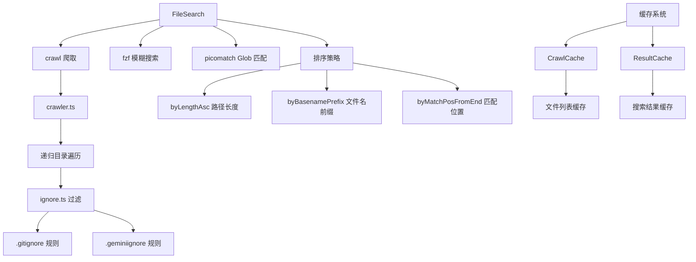

# filesearch 架构

> 文件搜索子系统，提供高性能的项目文件爬取、缓存和模糊搜索功能

## 概述

`filesearch` 子模块实现了 Gemini CLI 的文件搜索功能，支持 Glob 模式匹配和模糊搜索。它通过 `crawler` 遍历项目目录树构建文件索引，通过 `ignore` 模块处理 .gitignore 和 .geminiignore 规则过滤文件，通过 `ResultCache` 和 `CrawlCache` 两级缓存提高重复搜索性能。`FileSearch` 类是入口，使用 `fzf` 库进行高质量的模糊搜索排名，并支持多种平局打破策略（路径长度、文件名前缀匹配、匹配位置）。

## 架构图



## 目录结构

```
filesearch/
├── fileSearch.ts      # 文件搜索主类
├── crawler.ts         # 目录爬取器
├── ignore.ts          # 忽略规则加载器
├── crawlCache.ts      # 爬取结果缓存
└── result-cache.ts    # 搜索结果缓存
```

## 关键文件

| 文件 | 功能 |
|------|------|
| `fileSearch.ts` | `FileSearch` 类，提供 `search` 方法支持模糊搜索和 Glob 匹配。使用 `AsyncFzf` 进行模糊搜索排名，支持多种平局打破策略（路径长度优先、文件名前缀优先、匹配位置靠后优先）。支持结果数量限制和缓存 TTL 配置 |
| `crawler.ts` | `crawl` 函数递归遍历项目目录树，收集所有文件路径（相对路径）。遵守忽略规则，跳过 node_modules、.git 等目录。支持配置忽略目录列表和递归搜索开关 |
| `ignore.ts` | `loadIgnoreRules` 从项目根目录加载 .gitignore 和 .geminiignore 规则，返回 `Ignore` 实例用于过滤文件。支持多层级忽略规则合并 |
| `crawlCache.ts` | `CrawlCache` 缓存爬取结果（文件列表），支持 TTL 过期机制 |
| `result-cache.ts` | `ResultCache` 缓存搜索结果，key 为搜索模式，支持 TTL 过期 |

## 内部依赖

| 模块 | 用途 |
|------|------|
| `utils/paths` | unescapePath 路径处理 |
| `services/fileDiscoveryService` | FileDiscoveryService 文件发现服务 |

## 外部依赖

| 包 | 用途 |
|------|------|
| `fzf` | AsyncFzf 异步模糊搜索引擎 |
| `picomatch` | Glob 模式匹配 |
