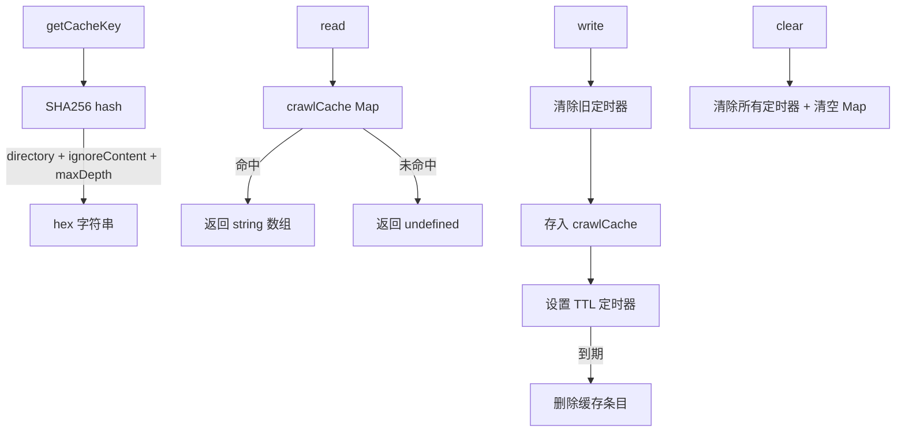

# crawlCache.ts

> 文件爬取结果的内存缓存，支持 TTL 自动过期

## 概述
该文件实现了文件搜索爬取结果的内存缓存层。文件系统爬取是开销较大的操作，通过缓存可以显著加速重复搜索。缓存键基于目录路径、ignore 规则内容和最大深度的 SHA256 哈希，确保任何配置变化都能正确失效缓存。每条缓存条目有独立的 TTL 定时器，到期后自动删除。

## 架构图

## 主要导出

### `function getCacheKey(directory, ignoreContent, maxDepth?): string`
- **用途**: 根据爬取目录、ignore 规则内容和可选的最大深度生成 SHA256 缓存键。任一参数变化都会产生不同的键。

### `function read(key: string): string[] | undefined`
- **用途**: 从缓存中读取爬取结果。未命中返回 `undefined`。

### `function write(key: string, results: string[], ttlMs: number): void`
- **用途**: 写入缓存条目并设置 TTL 定时器。若键已存在，先清除旧定时器再更新。

### `function clear(): void`
- **用途**: 清除所有缓存条目和活跃定时器。主要用于测试。

## 核心逻辑
- 使用两个 `Map`：`crawlCache` 存储数据，`cacheTimers` 存储对应的 `setTimeout` 句柄。
- 写入时先清除可能存在的旧定时器，再设置新的，防止提前删除更新后的条目。
- 定时器到期时同时清理两个 Map 中的对应条目。

## 内部依赖
无

## 外部依赖
- `node:crypto` -- SHA256 哈希
