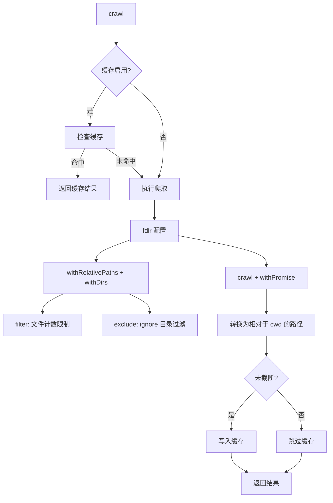

# crawler.ts

> 基于 fdir 的高性能文件系统爬取器，支持 ignore 过滤和结果缓存

## 概述
该文件封装了 `fdir` 文件爬取库，提供异步的目录爬取功能。它是文件搜索引擎的数据采集层，负责遍历项目目录树并返回所有文件和目录的相对路径列表。爬取过程中应用 ignore 规则排除被忽略的目录（如 `.git`、`node_modules`），支持最大深度限制和文件数量上限。爬取结果可被缓存以加速后续搜索。路径统一使用 POSIX 格式（正斜杠）以确保跨平台一致性。

## 架构图

## 主要导出

### `interface CrawlOptions`
- **用途**: 爬取配置：`crawlDirectory`（爬取目录）、`cwd`（项目根目录）、`maxDepth`（最大深度）、`maxFiles`（最大文件数）、`ignore`（Ignore 实例）、`cache`（是否缓存）、`cacheTtl`（缓存 TTL 秒数）。

### `function crawl(options: CrawlOptions): Promise<string[]>`
- **用途**: 异步爬取目录，返回所有文件和目录的相对路径数组（POSIX 格式）。支持 ignore 过滤、深度限制、文件数量限制和结果缓存。

## 核心逻辑
1. 若缓存启用，先检查缓存。
2. 使用 `fdir` 配置：`withRelativePaths`（相对路径）、`withDirs`（包含目录）、`withPathSeparator('/')`（POSIX 路径）。
3. `filter` 回调统计文件数，超出 `maxFiles` 时返回 false。
4. `exclude` 回调将目录路径转为相对路径后调用 `ignore.getDirectoryFilter()` 判断是否排除。
5. 结果路径从相对于爬取目录转换为相对于 `cwd`。
6. 仅在未截断（未超出 maxFiles）时写入缓存，避免缓存不完整结果。

## 内部依赖
- `./ignore.js` -- `Ignore` 类型
- `./crawlCache.js` -- 缓存读写

## 外部依赖
- `node:path` -- 路径处理
- `fdir` -- 高性能文件系统爬取库
