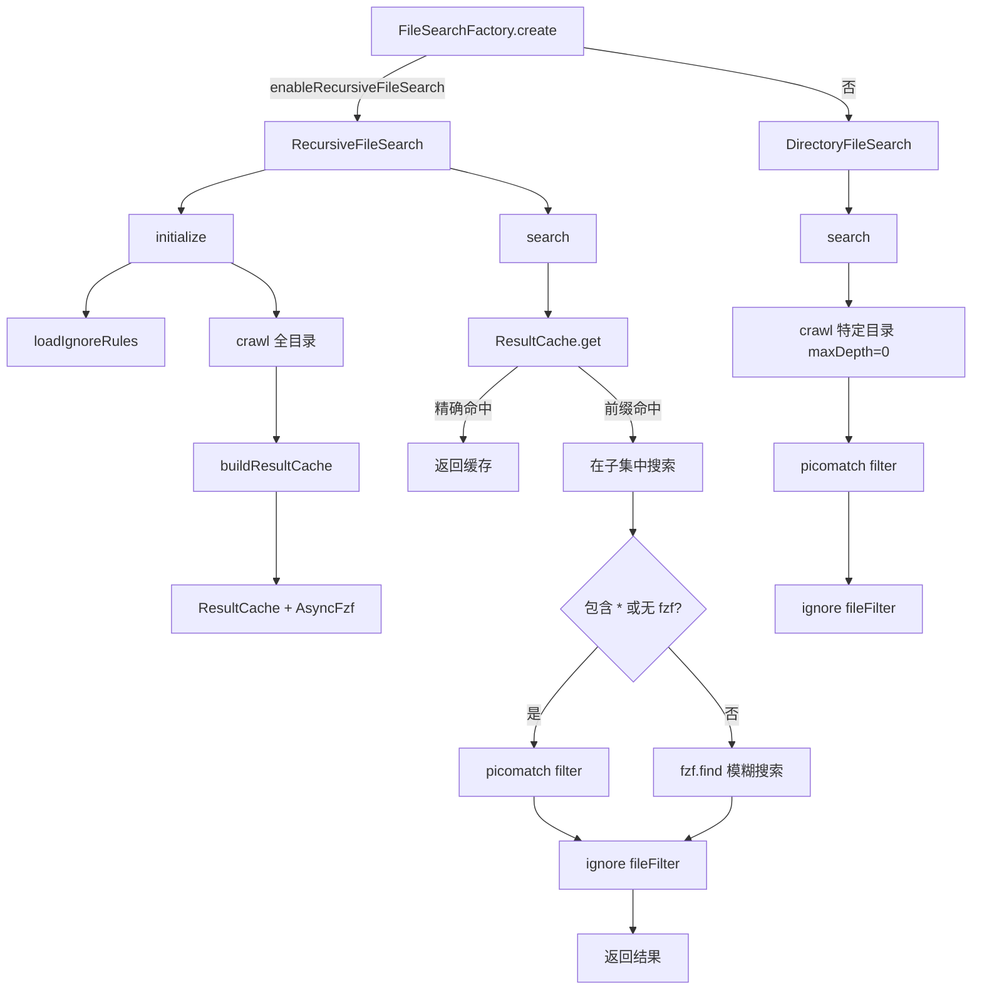

# fileSearch.ts

> 文件搜索引擎：支持 glob 模式匹配和模糊搜索（fzf），工厂模式创建

## 概述
该文件是文件搜索子系统的顶层模块，实现了完整的文件搜索引擎。提供两种搜索策略：`RecursiveFileSearch` 预先爬取整个项目目录树并使用 fzf 模糊搜索或 picomatch glob 过滤；`DirectoryFileSearch` 仅搜索特定目录层级。搜索结果通过 `ResultCache` 缓存，利用前缀匹配优化减少重复搜索。排序策略（文件名前缀匹配、路径末尾匹配、路径长度）确保最相关的结果排在前面。通过 `FileSearchFactory` 工厂模式根据配置创建对应的搜索实例。

## 架构图

## 主要导出

### `class AbortError extends Error`
- **用途**: 搜索被中止时抛出的错误。

### `function filter(allPaths, pattern, signal): Promise<string[]>`
- **用途**: 使用 picomatch 对路径列表进行 glob 模式过滤。支持 AbortSignal 中止。结果按目录优先、字典序排序。每 1000 项让出事件循环。

### `interface FileSearch`
- **方法**: `initialize(): Promise<void>`、`search(pattern, options?): Promise<string[]>`
- **用途**: 文件搜索引擎接口。

### `class FileSearchFactory`
- **静态方法 `create(options: FileSearchOptions): FileSearch`** -- 根据 `enableRecursiveFileSearch` 选项创建递归搜索或目录搜索实例。

### `interface FileSearchOptions`
- **用途**: 搜索配置：`projectRoot`、`ignoreDirs`、`fileDiscoveryService`、`cache`、`cacheTtl`、`enableRecursiveFileSearch`、`enableFuzzySearch`、`maxDepth`、`maxFiles`。

## 核心逻辑
1. **RecursiveFileSearch**:
   - `initialize`: 加载 ignore 规则，全量爬取项目文件，构建 ResultCache 和可选的 AsyncFzf 实例。
   - `search`: 先从 ResultCache 获取候选集（精确命中或前缀命中的子集），然后用 picomatch（含 `*` 时）或 fzf（模糊搜索）过滤，最后应用文件级 ignore 规则。
   - fzf 排序 tiebreakers：文件名前缀匹配 > 路径末尾匹配 > 路径长度短。超过 20K 文件时使用 v1 算法提升性能。
2. **DirectoryFileSearch**:
   - `search`: 仅爬取 pattern 指定的目录（maxDepth=0），用 picomatch 过滤后应用 ignore。
3. 两种搜索都支持 `maxResults` 限制和 AbortSignal 中止。

## 内部依赖
- `./ignore.js` -- `loadIgnoreRules`、`Ignore`
- `./result-cache.js` -- `ResultCache`
- `./crawler.js` -- `crawl`
- `../paths.js` -- `unescapePath`

## 外部依赖
- `node:path` -- 路径处理
- `picomatch` -- glob 模式匹配
- `fzf` -- 模糊搜索（AsyncFzf）
