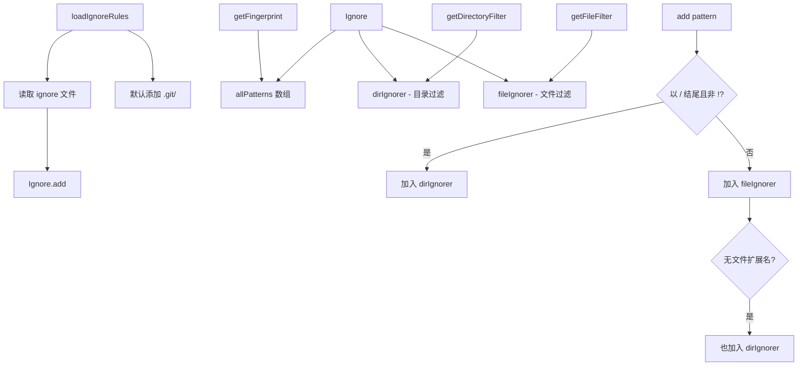

# ignore.ts

> 基于 .gitignore 风格的文件/目录忽略规则引擎

## 概述
该文件实现了文件搜索的忽略规则系统。它读取 `.gitignore`、`.geminiignore` 等忽略文件，并解析规则以在文件爬取过程中排除不需要的文件和目录。核心设计将规则分为目录过滤器和文件过滤器两类：目录过滤器用于在爬取阶段尽早剪枝（避免进入不需要的目录），文件过滤器用于最终的精确过滤。规则分类使用启发式方法：以 `/` 结尾的明确为目录规则，不含文件扩展名的模式同时作为目录规则。

## 架构图

## 主要导出

### `function loadIgnoreRules(service: FileDiscoveryService, ignoreDirs?: string[]): Ignore`
- **用途**: 从 `FileDiscoveryService` 获取所有忽略文件路径，读取并加载规则。自动添加 `.git/` 和用户指定的忽略目录。返回配置好的 `Ignore` 实例。

### `class Ignore`
- **`add(patterns: string | string[]): this`** -- 添加忽略规则。支持换行分隔的字符串或数组。自动分类为目录规则和文件规则。跳过空行和注释（`#` 开头）。
- **`getDirectoryFilter(): (dirPath: string) => boolean`** -- 返回目录过滤谓词，匹配应被排除的目录。
- **`getFileFilter(): (filePath: string) => boolean`** -- 返回文件过滤谓词，匹配应被排除的文件。
- **`getFingerprint(): string`** -- 返回所有规则拼接的字符串指纹，用于缓存键生成。

## 核心逻辑
- **规则分类启发式**: 以 `/` 结尾且不以 `!` 开头的为纯目录规则；其余为文件规则，但若模式最后一段不含 `.`（通过 `picomatch('**/*[*.]*')` 检测），则同时作为目录规则。这保证了像 `node_modules` 这样的模式既能排除目录（在爬取阶段剪枝）也能排除同名文件。
- **效率与正确性权衡**: 含 `.` 的目录模式（如 `my.assets`）不会被加入目录过滤器，导致该目录仍会被爬取。但最终的文件过滤器会正确排除其中的文件，因此正确性不受影响，仅影响爬取效率。
- 底层使用 `ignore` npm 包（兼容 `.gitignore` 语法）作为实际的规则匹配引擎。

## 内部依赖
- `../../services/fileDiscoveryService.js` -- `FileDiscoveryService` 类型

## 外部依赖
- `node:fs` -- 读取忽略文件
- `ignore` -- .gitignore 风格规则匹配引擎
- `picomatch` -- glob 模式匹配（用于扩展名检测）
