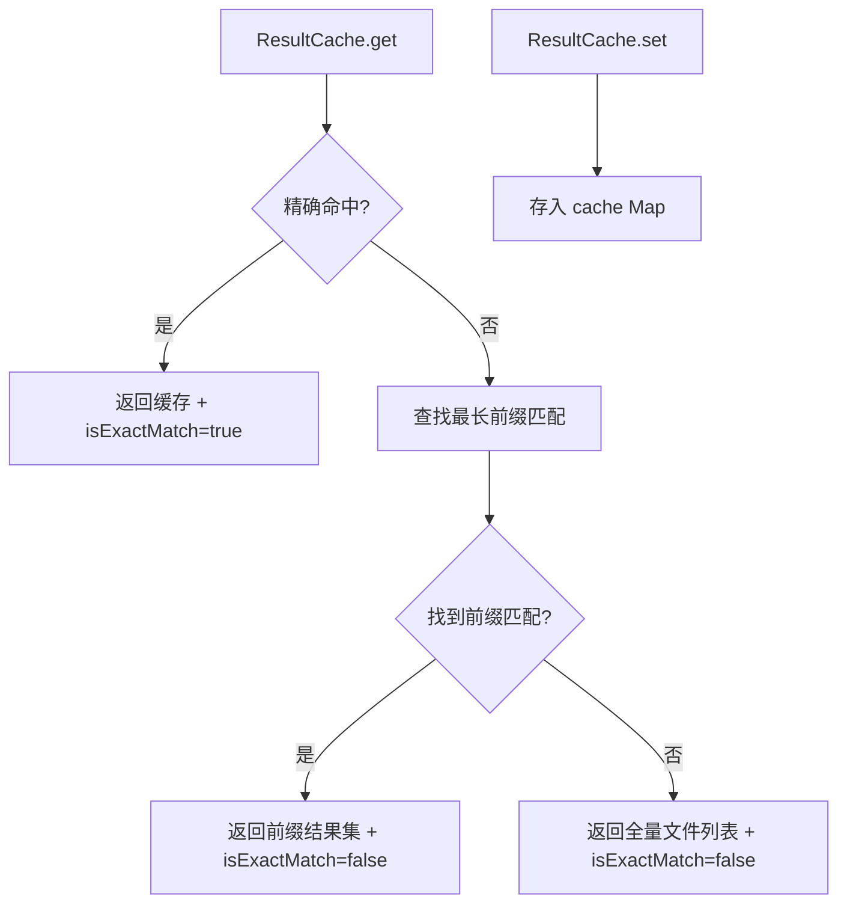

# result-cache.ts

> 文件搜索结果的内存缓存，支持前缀命中优化减少重复搜索

## 概述
该文件实现了一个专为文件搜索优化的内存缓存。核心优化策略是"前缀命中"：当用户搜索 `foobar` 时，如果之前已经搜索过 `foo`，则可以直接在 `foo` 的结果子集中搜索 `foobar`，而不必从全量文件列表开始。这对于增量输入场景（如用户逐字符输入搜索词）提供了显著的性能提升。

## 架构图

## 主要导出

### `class ResultCache`
- **`constructor(allFiles: string[])`** -- 创建缓存实例，`allFiles` 为全量文件列表作为 fallback。
- **`get(query: string): Promise<{ files: string[]; isExactMatch: boolean }>`** -- 获取搜索候选集。精确命中返回缓存结果；否则查找最长的前缀匹配作为候选集，无前缀匹配时返回全量列表。
- **`set(query: string, results: string[]): void`** -- 缓存搜索结果。

## 核心逻辑
- **精确命中**: 直接从 `Map` 中查找 query 键。
- **前缀优化**: 遍历所有缓存键，找到满足 `query.startsWith(key)` 的最长键，使用其缓存结果作为搜索基础。例如，缓存了 `src` 的结果后搜索 `src/utils` 时，只需在 `src` 的结果中搜索，而非全量文件列表。
- 内部跟踪 `hits` 和 `misses` 计数器，可用于缓存效率分析。

## 内部依赖
无

## 外部依赖
无
