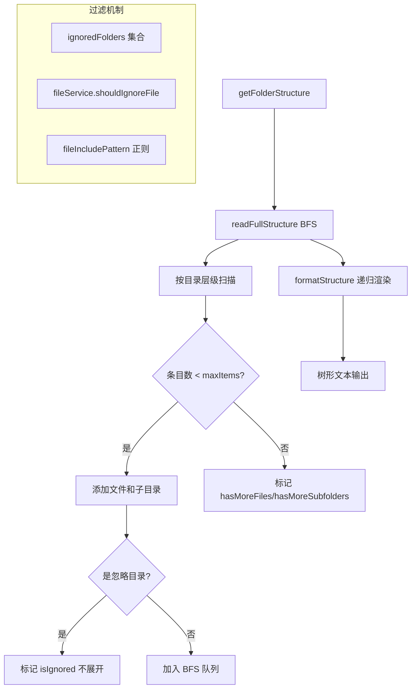

# getFolderStructure.ts

> 生成目录结构的树形文本表示，支持条目上限、忽略规则和文件过滤

## 概述
`getFolderStructure.ts` 实现了一个 BFS（广度优先搜索）目录扫描器，将文件系统的目录结构转换为带缩进和连接符的树形字符串。其设计动机是让 LLM 工具（如 `list_directory`）能够以结构化的方式向模型展示项目文件布局，同时通过条目上限（默认 200）防止输出过大。该文件在模块中作为"目录可视化引擎"。

## 架构图

## 主要导出

### 函数
- **`getFolderStructure(directory: string, options?: FolderStructureOptions): Promise<string>`** — 生成目录结构的格式化字符串，支持 maxItems、ignoredFolders、fileIncludePattern、fileService、fileFilteringOptions 等选项

## 核心逻辑
1. **BFS 扫描**：`readFullStructure` 使用队列实现广度优先遍历，按字母排序处理目录条目，先处理文件再处理子目录。
2. **条目计数**：全局维护 `currentItemCount`，每添加一个文件或目录即递增，达到 `maxItems` 后在对应节点标记 `hasMoreFiles` / `hasMoreSubfolders`。
3. **忽略规则**：支持两层忽略——(a) `ignoredFolders` 集合（默认含 node_modules、.git、dist、__pycache__）标记后不展开，(b) `fileService.shouldIgnoreFile` 基于 gitignore/geminiignore 过滤。
4. **树形渲染**：`formatStructure` 递归生成 ASCII 树，使用 `├───` / `└───` / `│   ` 等连接符，忽略目录后缀 `...`。
5. **防循环**：使用 `processedPaths` Set 防止符号链接导致的无限循环。

## 内部依赖
- `./errors.js` — `getErrorMessage`、`isNodeError`
- `../services/fileDiscoveryService.js` — `FileDiscoveryService`、`FilterFilesOptions`
- `../config/constants.js` — `DEFAULT_FILE_FILTERING_OPTIONS`、`FileFilteringOptions`
- `./debugLogger.js` — 调试日志

## 外部依赖
- `node:fs/promises` — 异步目录读取
- `node:path` — 路径操作
