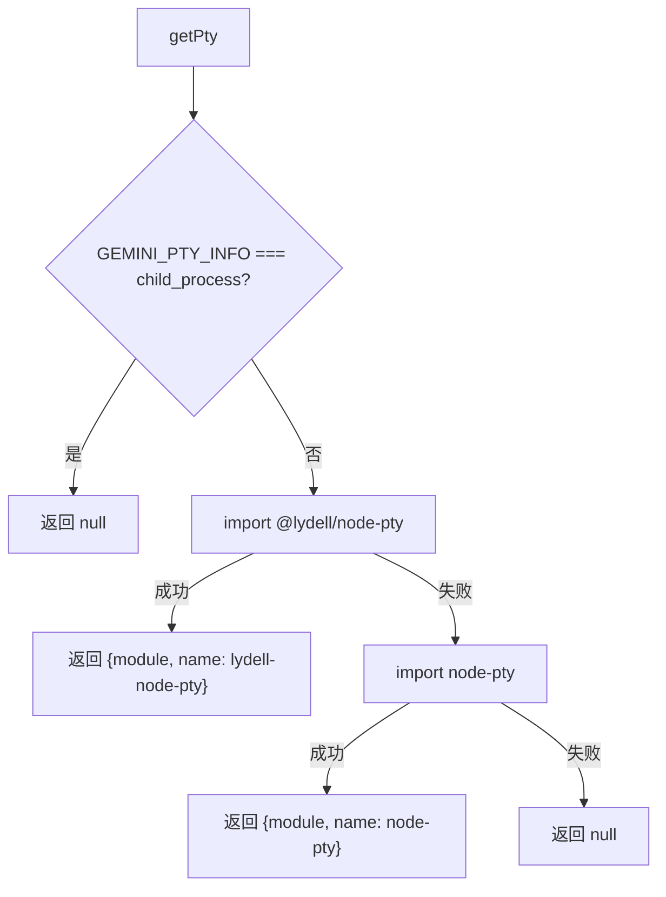

# getPty.ts

> 提供伪终端（PTY）模块的动态加载能力，支持 lydell-node-pty 和 node-pty 的降级回退

## 概述
`getPty.ts` 封装了伪终端库的动态导入逻辑，优先尝试加载 `@lydell/node-pty`，失败则回退到 `node-pty`，两者均不可用时返回 `null`。其设计动机是让 CLI 工具在不同环境中（有无原生编译依赖）都能优雅地处理终端模拟需求。当环境变量 `GEMINI_PTY_INFO` 设为 `child_process` 时，直接跳过 PTY 加载，使用普通子进程方案。

## 架构图

## 主要导出

### 类型
- **`PtyImplementation`** — PTY 实现对象 `{ module: any, name: 'lydell-node-pty' | 'node-pty' } | null`
- **`PtyProcess`** — PTY 进程接口，定义 `pid`、`onData`、`onExit`、`kill` 方法

### 函数
- **`getPty(): Promise<PtyImplementation>`** — 异步获取 PTY 实现，按优先级尝试加载

## 核心逻辑
- 使用动态 `import()` 而非静态导入，避免在不支持原生模块的环境中产生加载错误。
- 将包名赋值给变量后再 `import()`，这是为了绕过打包工具的静态分析。

## 内部依赖
无

## 外部依赖
- `@lydell/node-pty`（可选）— 首选 PTY 实现
- `node-pty`（可选）— 备选 PTY 实现
